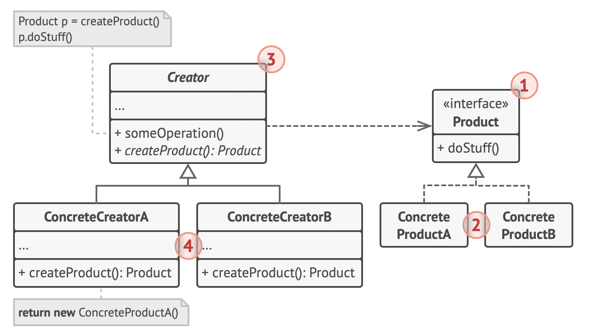

# 팩토리 메서드 패턴
## 팩토리 메서드 패턴이란? 
    객체를 생성하는데 생성자를 이용하는 것이 아니라 객체 생성 메서드를 정의하고 이를 사용하는 패턴을 말한다.

  
팩토리 메서드 패턴 도식도 

팩토리 메서드 패턴은 new를 이용한 객체 생성 방법을 팩토리 메서드를 이용하도록 권장한다. 
이때, 팩토리 메서드에 의해 리턴되는 객체를 Products라고 한다. 이 product에는 객체 생성시에 공통적으로 생산되어야 할 속성들을 정의한다. 
그리고 이를 구체화한 클래스를 만든다. 이를 Concrete Product라고 한다. 

Creator는 새로운 객체를 반환하는 팩토리 메서드를 정의한다. 이때, 리턴 타입은 product interface와 매칭되어야 한다. 
Creator를 각 product의 타입에 맞게 리턴할 수 있도록 재정의한 구체화한 클래스를 Concrete Creators라고 한다. 

## 실습
Button = Product   
Dialog = Creator  

~~~java
public interface Button {
    void render();
    void onClick();
}

public class HtmlButton implements Button {

    @Override
    public void render() {
        System.out.println("HTML Button입니다.");
    }

    @Override
    public void onClick() {
        System.out.println("HTML Button이 클릭되었습니다.");
    }
}
~~~

~~~java
public abstract class Dialog {

    public void renderWindow() {
        // ... other code ...
        Button button = createButton();
        button.render();
    }

    public abstract Button createButton();
}

public class HtmlDialog extends Dialog {
    @Override
    public Button createButton() {
        return new HtmlButton();
    }
}

~~~

여기서 이제 MyButton을 추가해보자. 이때, HtmlDialog의 코드의 변경에는 닫혀있는 상태에서 확장이 가능함을 확인하자.

~~~java
public class MyDialog extends Dialog {
    @Override
    public Button createButton() {
        return new MyButton();
    }
}

public class MyButton implements Button {

    @Override
    public void render() {
        System.out.println("MyButton 입니다.");
    }

    @Override
    public void onClick() {
        System.out.println("MyButton이 클릭되었습니다.");
    }
}
~~~

클라이언트 코드에서는 다음과 같이 사용한다.

~~~java
package factorymethod;

import personally.factorymethod.Dialog;
import personally.factorymethod.HtmlDialog;
import personally.factorymethod.MyDialog;

public class Client {

    private static Dialog dialog;

    public static void main(String[] args) {
        configure("myButton");
        run();
    }

    static void configure(String button) {
        if (button.equals("myButton")) {
            dialog = new MyDialog();
        } else {
            dialog = new HtmlDialog();
        }
    }

    static void run() {
        dialog.renderWindow();
    }
}
~~~

### 장점
    기존의 코드를 건드리지 않고 확장이 가능하기 때문에 코드가 간결해진다.

### 단점
    클래스가 많아진다.

