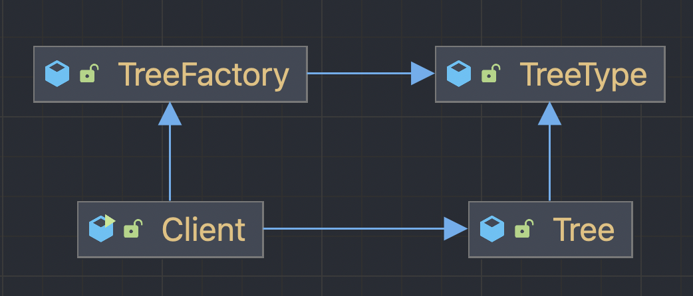
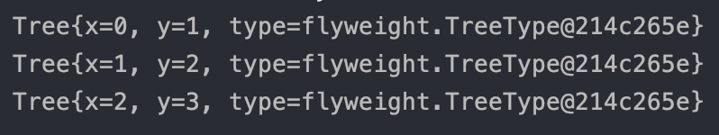

# 플라이웨이 패턴

## 플라이웨이 패턴이란?
플라이웨이 패턴은 많은 객체를 생성해야 할 때, 자주 사용되는 부분과 자주 사용되지 않는 부분을 분리함으로써 메모리 사용량을 줄이는 디자인 패턴을 말한다.

## 예제
나무를 생성하는 코드를 예제로 플라이웨이 패턴을 이해해보자. 큰 구조는 다음과 같다.

1. TreeType은 Tree를 생성할 때 공통적으로 사용되는 부분을 가지고 있다. 
~~~java
public class TreeType {

    private String name;
    private Color color;
    
    public TreeType() {};

    public TreeType(String name, Color color) {
        this.name = name;
        this.color = color;
    }
}
~~~

2. Tree는 위치를 나타내는 x, y좌표 필드와 공통된 속성인 TreeType을 가진다. 
~~~java
public class Tree extends TreeType {
    private int x;
    private int y;
    private TreeType type;

    public Tree(int x, int y, TreeType type) {
        this.x = x;
        this.y = y;
        this.type = type;
    }

    // 이후 출력을 위해 toString()을 오버라이드 하였다.
    @Override
    public String toString() {
        return "Tree{" +
                "x=" + x +
                ", y=" + y +
                ", type=" + type +
                '}';
    }
}
~~~

3. 클라이언트가 Tree를 생성할 때 TreeFactory를 이용하여 TreeType 인스턴스를 얻을 수 있도록 TreeFactory를 작성한다.
기본적으로 treeTypes에 생성된 객체들을 저장해놓고 만약 이미 생성한 객체이면 생성한 객체를 리턴하도록 되어 있다.
~~~java
public class TreeFactory extends TreeType {

    static Map<String, TreeType> treeTypes = new HashMap<>();

    public static TreeType getTreeTypes(String name, Color color) {
        TreeType result = treeTypes.get(name);
        if(result == null) {
            result = new TreeType(name, color);
            treeTypes.put(name, result);
        }
        return result;
    }
}
~~~

4. 클라이언트에서 Tree를 생성할 때 TreeFactory를 이용하여 생성한다.
~~~java
public class Client extends Tree {

    public static void main(String[] args) {
        TreeFactory treeFactory = new TreeFactory();
        Tree tree1 = new Tree(0, 1, treeFactory.getTreeTypes("자작나무", new Color(10, 10, 10)));
        Tree tree2 = new Tree(1, 2, treeFactory.getTreeTypes("자작나무", new Color(10, 10, 10)));
        Tree tree3 = new Tree(2, 3, treeFactory.getTreeTypes("자작나무", new Color(10, 10, 10)));

        System.out.println(tree1);
        System.out.println(tree2);
        System.out.println(tree3);
    }
}
~~~

type객체가 모두 같은 객체임을 확인할 수 있다.  

### 장점
중복되는 데이터를 가지지 않게 되기 때문에 메모리 사용을 줄일 수 있다.

### 단점
팩토리를 통해 객체를 생성함으로 코드의 복잡성이 증가한다.
