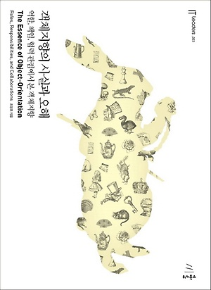
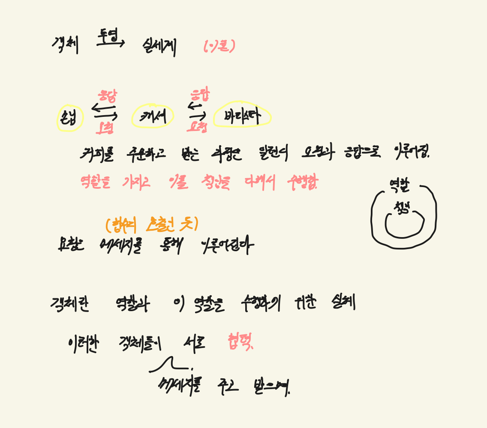

# 객체지향의 사실과 오해

---
## 목차
- [객체지향의 사실과 오해](#---)
    * [[CH.1] 협력하는 객체들의 공동체](#ch1-협력하는-객체들의-공동체)
    * [[CH.2] 객체는 행동을 기준으로 설계하자](#ch2-객체는-행동을-기준으로-설계하자)
    * [[CH.3] 타입과 추상화](#ch3-타입과-추상화)
    * [[CH.4] 역할, 책임, 협력](#ch4-역할-책임-협력)
    * [[CH.5] 책임과 메세지](#ch5-책임과-메세지)
    * [[CH.6 객체지도]](#ch6-객체지도)
    * [[CH.7] 함께 모으기](#ch7-함께-모으기)

## [CH.1] 협력하는 객체들의 공동체

이론적으로만 봤을 때 객체지향이라는 것은 객체를 실세계에 투영한 것이라고 할 수 있다. 
사람, 커피, 핸드폰 등을 모두 객체라고 할 수 있다. 객체는 각자의 역할을 가지고 책임을 다해 이를 수행한다.  
특정 목적을 달성하기 위해 객체들은 서로 협력하는 관계를 맺으며 이 때 요청과 응답을 통해 작업이 이루어진다. 요청을 할 때는 메세지라는 것을 이용한다.  

---

## [CH.2] 객체는 행동을 기준으로 설계하자

객체는 상태를 가지고 있으며, 어떤 목적을 이루기 위해 특정 행동을 취한다. 
객체의 상태는 행동을 통해 변경될 수 있지만, 행동의 결과는 이전 상태에 영향을 받기도 한다. 
키가 커지는 케이크가 있다고 하면 케이크를 먹고 난 후의 키는 이전(현재)키에서 영향을 받기 때문이다. 
그래서 특정 행동을 할 때는 이전에는 어떤 행동을 했고 그래서 지금 이런 상태에 있어라고 알려주어야 한다. 

그런데 이런 이력을 모두 행동할 때마다 전달하는 것은 장황하다. 이런 것을 모두 대체할 수 있는 것이 상태이다.
행동은 상태에 의존적이며 부수 효과를 일으킨다. 객체의 행동은 상태를 변경시키는데 상호작용하는 다른 객체에 메세지를 보냄으로써 다른 객체의 상태에도 영향을 줄 수 있다.

객체 지향 세계에서 모든 객체는 자신의 상태를 스스로 관리하는 자율적인 존재로 실세계의 수동적인 존재도 특정 행동의 주체가 된다. 예를 들어 음료와 사람이라는 객체의 상호작용에서 500ml음료를 100ml 마신다면 이 상태를 변경시키는 것은 사람이 아니라 음료이다. (사람은 단지 요청만 보낸다.) 이렇게 객체는 스스로 판단하고 결정하기 때문에 객체의 자율성이 높아지고 이는 협력을 단순하고 용이하게 만든다 (캡슐화)

- 값의 경우 상태 값을 통해 같은지 판단 가능하다. 하지만 객체의 경우 가변 상태를 가지기 때문에 객체를 유일하게 식별할 수 있는 식별자를 가진다.
- 객체의 상태를 조회하는 작업을 쿼리, 변경하는 작업을 명령(Command)라고 한다. 사용자는 객체가 제공하는 명령 버튼과 쿼리 버튼으로 구성된 인터페이스를 통해서만 객체에 접근할 수 있다.
- 객체를 설계할 때는 상태 기준이 아닌 행동을 기준으로 설계해야 한다. 객체는 다른 객체와 협력하기 위해 존재하며 행동은 객체가 참여하는 유일한 방법이다.

---

## [CH.3] 타입과 추상화

추상화란 어떤 양상, 세부 사항, 구조를 좀 더 명확하게 이해하기 위해서 특정 절차나 물체를 의도적으로 생략함으로써 복잡도를 극복하는 방법이다. 즉, 추상화의 목적은 불필요한 부분을 무시함으로써 복잡성을 줄이는 것이다.

→ 구체적인 사물들 간의 공통점은 취하고 차이점은 버린다.

→ 중요한 부분을 강조하기 위해 불필요한 세부 상항을 제거한다.

의사, 판사, 바리스타 등을 모두 개별적인 단위로 취급하기는 복잡하며, 쉽지 않은 일이다. 따라서  사고를 할 수 있으며, 말을 할 수 있다 등의 공통점을 기반으로  인간이라고 분리할 수 있다. 이처럼 공통점을 기반으로 객체들을 묶기 위한 그릇을 개념이라고 한다. 개념을 이용하면 객체를 여러 그룹으로 분류 할 수 있다.

개념은 특정한 객체가 어떤 그룹에 속할 것인지를 결정한다. 일반적으로 개념을 이야기 할 때는 다음 세 가지 관점을 함께 알아야 한다.

1. 심볼 : 개념을 가리키는 간략한 이름이나 명칭
2. 내연 : 개념의 완전한 정의를 나타내며 내연의 의미를 이용해 객체가 개념에 속하는지 여부를 확인할 수 있다.
3. 외연 : 개념에 속하는 모든 객체의 집합

어떤 객체와 마주했을 때 객체에게 적용할 개념을 적용하는 것은 유지보수 측면에서 굉장히 중요하다. 만약 잘못된 개념을 적용했을 경우에는 유지보수가 어렵고 변화에 쉽게 대처하지 못하게 된다. 따라서 특정한 객체를 특정한 개념의 객체 집합에 포함시킬지를 결정하는 분류 작업을 굉장히 중요하다고 할 수 있다.

객체와 타입(타입 = 개념)

1. 어떤 객체가 어떤 타입에 속하는지를 결정하는 것은 객체가 수행하는 행동이다.
2. 객체의 내부적인 표현은 외부로부터 철저하게 감춰줘야 한다.

객체의 행동에 의해 타입이 결정된다는 사실은 다형성과도 직결되기도 한다. 같은 타입에 속한 객체는 행동만 동일하다면 서로 다른 데이터를 가질 수 있으며 내부의 데이터 표현 방식이 다르더라도 동일한 메세지를 수신하고 이를 처리할 수 있다. (처리 방식은 다를 수 있다.)

- 일반화는 추상화를 위한 도구이다. 중요한 부분을 강조하기 위해 불필요한 세부 사항을 제거시켜 단순하게 만들 수 있는데 일반화/특수화의 개념이 이 때 사용된다. 공통 속성은 일반화(슈퍼타입), 특수 속성은 특수화(서브 타입)에 설정한다.
- 타입을 왜 사용해야 하는가? → 인간의 인지 능력으로는 시간에 따라 동적으로 변하는 객체의 복잡성을 극복하기가 너무 어렵기 때문이다. 앨리스의 키가 동적으로 변하더라도 같은 객체인데, 타입은 시간에 따라 동적으로 변는 앨리스의 상태를 시간과 무관한 정적인 모습으로 다룰 수 있게 해준다.
- 객체를 분류하는 기준은 타입이며 타입을 나누는 기준은 객체가 수행하는 행동이다. 객체를 분류하기 위해 타입을 결정한 후 프로그래밍 언어를 이용한 타입을 구별할 수 있는 한 가지 방법이 클래스이다.

---

## [CH.4] 역할, 책임, 협력

### 최후통첩 게임 결론

- 인간이 어떤 본질적인 특성을 지니고 있느냐가 아닌 어떤 상황에 처해 있느냐가 인간의 행동을 결정한다.
- 객체지향 세계에서도 어떤 협력에 참여하는지가 객체에 필요한 행동을 결정하고, 행동이 객체의 상태를 결정한다.

### [협력]

- 한 사람이 다른 사람에게 도움을 **요청**함으로써 시작한다.
- 요청을 받은 사람은 일을 처리한 후 요청한 사람에게 필요한 지식이나 서비스를 제공하는 것으로 **응답**한다.
- 협력은 다수의 요청과 응답으로 구성된다.
- 모든 사람이 모든 책임을 가질 수는 없으며, 특정한 요청을 받아들일 수 있는 사람은 그 요청에 대해 적절한 방식으로 응답하는 데 필요한 지식과 행동 방식을 가지고 있기 때문이다.
- 요청과 응답은 협력에 참여하는 객체가 수행할 책임을 정의한다.

### [책임]

- 어떤 객체가 어떤 요청에 대해 대답해 줄 수 있거나, 적절한 행동을 할 의무가 있는 경우 해당 객체가 책임을 가진다고 말한다.
- 객체의 책임은 크게 ‘하는 것’과 ‘아는 것’의 두 가지 범주로 분류된다.

        → 객체가 무엇을 하고 있는가(knowing)

        → 객체가 무엇을 할 수 있는가(doing) 

- 협력 안에서 객체는 다른 객체로부터 요청이 전송됐을 경우에만 자신에게 주어진 책임을 수행한다.
- 객체가 다른 객체에게 주어진 책임을 수행하도록 요청을 보내는 것을 메세지 전송이라고 한다.

### [역할]

- 어떤 객체가 수행하는 책임의 집합은 객체가 협력 안에서 수행하는 역할을 암시한다.
- 알바 = 바리스타, 사장 = 캐셔 (바리스타와 캐셔를 역할이라고 한다)
- 역할은 재사용 가능하고 유연한 객체지향 설계를 낳는 매우 중요한 구성요소이다.
- 역할의 개념을 사용하면 유사한 협력을 추상화해서 인지 과부하를 줄일 수 있다.
- 다양한 객체들이 협력에 참여할 수 있기 때문에 협력이 좀 더 유연해지면 다양한 객체들이 동일한 협력에 참여할 수 있기 때문에 재사용성이 높아진다.
- 객체지향 설계의 단순성, 유연성, 재사용성을 뒷받침하는 핵심 개념이다.

### [객체지향 설계 기법]

1. 책임 주도 설계
- 협력에 필요한 책임들을 식별하고 적합한 객체에게 책임을 할당하는 방식
- 시스템 기능 파악 → 시스템의 책임을 더 작은 책임으로 분할 → 분할된 책임을 수행할 수 있는 적절한 역할(객체)를 찾아 할당 → 객체가 책임을 수행하는 중에 다른 객체의 도움이 필요한 경우 이를 책임질 적절한 객체 찾기 → 해당 객체에게 책임을 할당

2. 디자인 패턴
- 전문가들이 반복적으로 사용하는 해결 방법을 정의해 놓은 설계 템플릿의 모음

3. 테스트 주도 개발(TDD)
- 테스트를 먼저 작성하고 테스트를 통과하는 구체적인 코드를 추가하면서 애플리케이션을 완성하는 개발 방법.
- TDD의 목적은 구체적인 코드를 작성해나가면서 역할, 책임, 협력을 식별하고 식별된 역할, 책임, 협력이 적합한지 피드백 받는 것에 있다.

---

### [CH.5] 책임과 메세지

### [자율적인 책임]

- 객체지향 공동체의 기본 단위는 ‘자율적’인 객체
- 자율적인 객체란 스스로의 의지와 판단에 따라 각자 맡은 책임을 수행하는 객체
- e.g ) 캐셔는 커피 주문을 받고 이를 바리스타에게 전달하면 커피가 어떻게 만들어지는지는 신경 쓰지 않는다. 여기서 바리스타는 자신이 알고 있는 방법으로 커피를 만들어 전달한다. 하지만 캐셔가 핸드드립 머신을 이용해서 커피를 만들어주세요라고 하는 것은 바리스타의 자율성을 침해한다고 볼 수 있다. (다른 매체를 이용할 수 있는 자율성도 제한한다) 즉, 커피를 만드는 책임을 가지지만, 커피를 만드는 구체적인 방법이나 절차에 대해서는 최대한의 자유를 느낀다.
- 책임이 협력의 의도를 명확하게 표현하지 못할 정도로 추상적이면 문제가 된다.
- e.g ) “음료 만들어주세요”와 같이 너무 추상적이면 어떤 음료를 만들어야 되는지 모른다. 따라서 “커피 만들어주세요”와 같이 의도를 명확하게 설명할 수 있는 수준안에서 추상적이어야 한다.
- 자율적인 책임의 특징은 객체가 무엇(what)을 해야 하는가를 설명한다.

### [메시지]

- 객체는 오직 메세지를 전송함으로써 다른 객체에 접근할 수 있다.
- `메세지 = 메세지 이름 + 인자` (커피만들어주세요(스타벅스 원두))
- `메세지 전송 = 수신자 + 메세지` (바리스타.커피만들어주세요(스타벅스 원두)
- 커피만 잘 만들어진다면 책임을 수행하는 방법을 바꿔도 상관없다. (외부에서는 알 수 없다)
- 객체가 제공하는 메시지는 외부의 다른 객체가 볼 수 있는 공개된 영역
- 메세지를 처리하기 위해 책임을 수행하는 방법은 다른 객체가 볼 수 없는 사적인 영역

### [메서드]

- 메시지를 처리하기 위해 내부적으로 선택하는 방법
- ‘커피 만들어주세요’라는 메시지를 처리하기 위해 바리스타가 내부적으로 선택하는 방법 → 메서드
- 메시지는 ‘어떻게’ 수행될 것인지는 명시하지 않는다. 메시지는 단지 오퍼레이션을 통해 ‘무엇’이 실행되기를 바라는지만 명시하며, 어떤 메서드를 선택할 것인지는 전적으로 수신자의 결정에 좌우된다.

### [다형성]

- 서로 다른 유형의 객체가 동일한 메세지에 대해 서로 다르게 반응하는 것

      → 메시지는 ‘무엇’이 실행될지는 명시하지만 메세지를 ‘어떻게’실행할 것인지는 전적으로 수신자가 결정하기 때문에 가능함.

- 서로 다른 객체들이 다형성을 만족시킨다는 것은 객체들이 동일한 책임을 공유한다는 것을 의미.

  → 송신자의 관점에서 수신자들을 구별할 필요가 없음.

- 동일한 역할을 수행할 수 있는 객체들 사이의 **대체 가능성**을 의미
- 객체들의 대체 가능성을 이용해 설계를 유연하고 재사용 가능하게 만든다.

  → 캐셔가 바리스타(알바1), 바리스타(알바2)에 요청을 하던 커피를 만들 수 있는 수신자라면 어떤 누구와도 협력이 가능하다. 즉, 캐셔에게 영향을 주지 않고 메세지를 수신할 객체의 타입을 자유롭게 추가할 수 있다.

- 다형성은 송신자와 수신자 간의 객체 타입에 대한 결합도를 메시지에 대한 결합도로 낮춤으로써 달성된다.
- 유연하고 확장 가능하고 재사용성이 높은 협력의 의미

      → 협력이 유연해진다 : 송신자는 수신자가 메세지를 이해한다면 누구라도 상관없다.

      → 협력이 수행되는 방식을 확장할 수 있다 : 송신자에게 아무런 영향도 미치지 않고 수신자를 교체할 수 있다. 

      → 협력이 유연해진다. : 협력에 영향을 미치지 않기 때문에 다양한 객체들이 수신자의 자리를 대체할 수 있다.

- 송신자와 수신자를 약하게 연결하는 메세지

  → 송신자는 오직 메세지만 바라본다. 즉, 수신자의 정확한 타입을 모르더라도 상관없다.

  → 수신자와 송신자는 메시지라는 얇은 끈으로만 이어져 있다. 즉, 메시지를 기반으로 한 두 객체 사이의 이 낮은 결합도가 설계를 유연하고 확장 가능하며 재사용 가능하게 만들어준다.

### [객체 지향의 핵심은 메시지]

- 클래스는 단지 동적인 객체들의 특성과 행위를 정적인 텍스트로 표현하기 위해 사용할 수 있는 추상화 도구일 뿐이다.
- 객체들의 속성과 행위를 식별하는 것이 클래스를 정의하는 것보다 먼저다.

→ 가장 흔히 범하는 실수는 협력이라는 문맥을 배제한 채 객체 내부의 데이터 구조를 먼저 생각한 후 데이터 조작에 필요한 오퍼레이션을 나중에 고려하는 것이다.

→ 데이터를 중심으로 객체를 설계하는 방식은 객체의 내부 구조를 객체 정의의 일부로 만들기 때문에 객체의 자율성을 저해한다.

→ 협력 관계 속에서 다른 객체에게 무엇을 제공해야 하고 다른 객체로부터 무엇을 얻어야 하는가라는 관점에서 접근할 때 훌륭한 책임을 수확할 수 있다.

### [What/Who 사이클]

책임-주도 설계의 핵심은 어떤 행위가 필요한지를 먼저 결정한 후에 이 행위를 수행할 객체를 결정하는 것이다. 이 과정을 흔히 What/Who 사이클이라고 한다.

- ‘어떤 행위(what)’를 수행할 것인지를 결정한 후에 ‘누가(who)’그 행위를 수행할 것인지 결정한다.

### [묻지 말고 시켜라]

- 메시지를 결정하기전까지는 객체에 관해 고민하지 말아야 한다. 일단 메세지를 결정하자
- 메시지를 결정하는 시점에서는 어떤 객체가 메시지를 수신할 것인지 알 수 없기 대문에 당연히 메시지 송신자는 메시지를 수신할 객체의 내부 상태를 볼 수 없다. 따라서 메시지 중심 설계는 메시지 수신자의 캡슐화를 증진시킨다.
- 송신자가 수신자의 내부 상태를 미리 알 수 없기 때문에 송신자와 수신자가 느슨하게 결합된다.
- 결과적으로 객체를 자율적으로 만들고 캡슐화를 보장하며 결합도를 낮게 유지시켜 주기 때문에 설계를 유연하게 만든다.

### [인터페이스]

- 어떤 두 사물이 마주치는 경계 지점에서 서로 상호작용할 수 있게 이어주는 방법이나 장치를 의미한다.
- 세계에 존재하는 그 어떤 대상과 상호작용하고 싶다면 그 대상이 제공하는 인터페이스의 사용법을 익혀야 한다. (e.g 엘리베이터를 타고 원하는 층에 도착하기 위해 버튼을 누른다)

[인터페이스의 3가지 특징]

1. 인터페이스의 사용법을 익히기만 하면 내부 구조나 동작 방식을 몰라도 쉽게 대상을 조작하거나 의사를 전달할 수 있다.
2. 인터페이스 자체는 변경하지 않고 단순히 내부 구성이나 작동방식만을 변경하는 것은 인터페이스 사용자에게 어떤 영향도 미치지 않는다.
3. 대상이 변경되더라도 동일한 인터페이스를 제공하기만 하면 아무런 문제 없이 상호작용할 수 있다.

[인터페이스와 구현의 분리]

객체적인 관점에서 생각하는 방법

1. 좀 더 추상적인 인터페이스 : 의도를 알 수 있을 정도의 적당한 추상적인 인터페이스는 수신자의 자율성을 제공하기 때문에 좀 더 유연하다
2. 최소 인터페이스 : 외부에서 사용할 필요가 없는 인터페이스는 최대한 노출하지 않는다. 즉, 실제 협력에 필요한 메세지 이외의 불필요한 메시지를 공용 인터페이스에 포함하지 않아도 된다.
3. 인터페이스는 외부에서 접근 가능한 공개 인터페이스(공용 인터페이스)와 내부에서만 접근할 수 있는 감춰진 인터페이스(구현)로 구분된다.

[구현]

- 객체를 구성하지만 공용 인터페이스에 포함되지 않는 모든 것
- e.g ) 상태를 어떻게 표현할 것인지

[인터페이스와 구현의 분리 원칙]

- 객체를 설계할 때 객체 외부에 노출되는 인터페이스와 객체의 내부에 숨겨지는 구현을 명확하게 분리해서 고려해야 한다.
- 적절한 구현을 선택하고 이를 인터페이스 뒤로 감추는 것은 객체의 자율성을 향상시킬 수 있는 가장 기본적인 방법이다.  ( Car ← MyCar)

[캡슐화]

- 객체의 자율성을 보존하기 위해 구현을 외부로부터 감추는 것
- 상태와 행위를 함께 캡슐화함으로써 충분히 협력적이고 만족스러울 정도의 자율적인 존재가 될 수 있다.

객체지향의 캡슐화는 두 가지 관점에서 사용된다.

1. 상태와 행위의 캡슐화 : 객체는 상태와 행위의 조합이다. 객체는 스스로 자신의 상태를 관리하며 상태를 변경하고 외부에 응답할 수 있는 행동을 내부에 함께 보관한다.
2. 사적인 비밀의 캡슐화 : 객체도 보안에 민감하다. 객체는 외부의 객체가 자신의 내부 상태를 직접 관찰하거나 제어할 수 없도록 막기 위해 의사소통 가능한 특별한 경로만 외부에 노출한다. 이처럼 외부에서 객체와 의사소통할 수 있는 고정된 경로를 공용 인터페이스라고 한다. 개인적인 비밀은 공용 인터페이스 뒤에 감춤으로써 외부의 불필요한 공격과 간섭으로부터 내부 상태를 격리할 수 있다. 즉, 객체는 공용 인터페이스를 경계로 최대한의 자율성을 보장받을 수 있다.

### [책임의 자율성이 협력의 품질을 결정한다]

1. 자율적인 책임은 협력을 단순하게 만든다 : 커피를 만들기만 하면 어떻게 만들었는지 캐셔는 상관하지 않는다.
2. 자율적인 책임은 외부와 내부를 명확하게 분리한다 : 캐셔는 바리스타가 외부에 노출한 책임은 볼 수 있지만 커피를 어떻게 만드는지는 알 수 없다
3. 책임이 자율적인 경우 책임을 수행하는 내부적인 방법을 변경하더라도 외부에 영향을 미치지 않는다 : 커피를 만드는 방법이 바뀌어도 커피를 만들어내기만 하면 외부에 영향을 미치지 않는다.
4. 자율적인 책임은 협력의 대상을 다양하게 선택할 수 있는 유연성을 제공한다 : 커피를 만들 수만 있다면 새로운 바리스타가 와서 일을 할 수 있다.
5. 객체가 수행하는 책임들이 자율적일수록 객체의 역할을 이해하기 쉬워진다 : 커피를 만든다, 커피를 전달한다는 두 가지 책임이 모여 알바가 바리스타라는 역할을 수행한다는 사실을 알 수 있다.

---

## [CH.6 객체지도]

기능에 대한 요구사항이 계속 변함에도 지도는 모든 요구사항을 수용할 수 있다. 이는 지도가 기능에 비해 상대적으로 잘 변하지 않는 안정적인 지형 정보를 기반으로 하고 있기 때문이다. 즉, 기능이 아니라 구조를 기반으로 모델을 구축하는 편이 좀 더 범용적이고 이해하기 쉬우며 변경에 안정적이다.

### 기능 설계 대 구조 설계

기능 측면의 설계는 제품이 사용자를 위해 무엇을 할 수 있는지에 초점을 맞춘다. 구조 측면의 설계는 제품의 형태가 어떠해야 하는지에 초점을 맞춘다. 변경의 여지를 남겨 놓는 가장 좋은 방법은 자주 변경되는 기능이 아닌 안정적인 구조를 중심으로 설계함으로써 변화에 유연하게 대처할 수 있다. 기능 중심의 설계는 각 기능들이 서로 밀접하게 관련된 하나의 덩어리를 이루기 때문에 기능이 변경될 경우 기능의 축을 따라 크게 요동친다.

### 두 가지 재료: 기능과 구조

객체지향 세계를 구축하기 위해서는 사용자에게 제공할 ‘기능’과 기능을 담을 안정적인 ‘구조’라는 재료가 준비돼 있어야 한다.

1. 기능
- 사용자가 자신의 목표를 달성하기 위해 사용할 수 있는 시스템의 서비스
- 사용자의 목표를 만족시키기 위해 책임을 수행하는 시스템의 행위로 표현
- 기능을 수집하고 표현하기 위한 기법으로 유스케이스 모델링이 있음.

1. 구조
- 시스템의 기능을 구현하기 위한 기반으로 기능 변경을 수용할 수 있도록 안정적이어야 한다.
- 구조는 사용자가 도메인에 관해 생각하는 개념과 개념들 간의 관계로 표현한다.

### 구조

- 도메인 모델 : 사용자가 프로그램을 사용하는 대상 분야

→ e.g ) 환자의 진료 기록을 보관하고 분석하는 병원 소프트웨어

→ 변경이 적고 비교적 그 특성이 오랜 시간 유지되는 편이다.

→ 도메인의 개념들은 코드에서 사용할 개념과 관계를 제공한다.

- 모델 : 대상을 추상화하고 단순화한 것
- 도메인 모델을 구성하는 개념은 비즈니스가 없어지거나 완전히 개편되지 않는 한 안정적으로 유지된다. (이자, 정기예금과 같은 개념은 금융상품이 없어지지 않는 한 안정적으로 유지된다.)
- 도메인 모델을 구성하는 개념 간의 관계는 비즈니스 규칙을 기반으로 하기 때문에 비즈니스 정책이 크게 변경되지 않는 한 안정적으로 유지된다.
- 노먼의 멘탈 모델 : 사용자의 모델과 설계자의 모델이 동일하면 가장 이상적이며, 설계자는 디자인 모델을 기반으로 만든 시스템 이미지가 사용자 모델을 정확하게 반영하도록 노력해야 한다.

### 기능

시스템이 사용자에게 제공해야 하는 기능의 목록을 정리한 것을 기능적 요구사항이라고 한다. 이를 위해 유스케이스를 사용할 수 있다.

[유스케이스]

사용자의 목표를 달성하기 위해 사용자와 시스템 간에 이뤄지는 상호작용의 흐름을 텍스트로 정리한 것

1. 유스케이스는 사용자와 시스템 간의 상호작용을 보여주는 ‘텍스트’다.  즉, 상요자와 시스템 간의 상호작용을 일련의 이야기 흐름으로 표현하는 것이 유스케이스의 핵심이다.
2. 유스케이스는 하나의 시나리오가 아니라 여러 시나리오들의 집합이다.
3. 유스케이스는 단순히 기능을 나열하는 것이 아니라 이야기를 통해 연관된 기능들을 함께 묶을 수 있다.
4. 유스케이스는 사용자 인터페이스와 관련된 세부 정보를 포함하지 말아야 한다. 즉, 사용자 관점에서 시스템의 행위에 초점을 맞춰야 한다.
5. 유스케이스는 내부 설계와 관련된 정보를 포함하지 않는다. 유스케이스에는 단지 사용자가 시스템을 통해 무엇을 얻을 수 있고 어떻게 상호작용할 수 있느냐에 관한 정보만 기술된다.

더 많은 자료는 Strucutring Use Cases with Goals (Cockburn 1997)을 참고하자

### 재료 합치기: 기능과 구조의 통합

- 변경에 유연한 소프트웨어를 만들기 위해서는 유스케이스에 정리된 시스템의 기능을 도메인 모델을 기반으로 한 객체들의 책임으로 분배해야 한다.
- 유스케이스는 사용자에게 제공할 기능을 시스템의 책임으로 보게 함으로써 객체 간의 안정적인 구조에 책임을 분배할 수 있는 출발점을 제공한다.
- 도메인 모델은 기능을 수용하기 위해 은유할 수 있는 안정적인 구조를 제공한다.
- 책임-주도 설계 방법은 시스템의 기능을 역할과 책임을 수행하는 객체들의 협력 관계로 바라보게 함으로써 두 가지 기본 재료를 통합한다.
- 책임 할당의 기본 원칙은 책임을 수행하는 데 필요한 정보를 가진 객체에게 그 책임을 할당하는 것이다.

→ 이자를 계산하는 책임을 가진 객체는 이자율이 될 것이며, 이자는 이자율에 의해 생성될 것이다. 이자를 계산하는 책임은 책임 할당 기본 원칙에 의해 이자율 객체에 할당한다.

---

## [CH.7] 함께 모으기

### 마틴 파울러의 세 가지 상호 연관된 관점

- 개념 관점 : 도메인 안에 존재하는 개념과 개념들 사이의 관계를 표현한다.
- 명세 관점 : 사용자의 영역인 도메인을 벗어나 개발자의 영역인 소프트웨어로 초점이 옮겨진다. 프로그래머는 객체가 협력을 위해 ‘무엇’을 할 수 있는가에 초점을 맞춘다.
- 구현 관점 : 객체들이 책임을 수행하는 데 필요한 코드를 작성한다.

클래스의 공용 인터페이스는 명세 관점을, 속성과 메서드는 구현 관점을 반영한다.

### 커피 전문점 예제

이 부분은 책을 꼭 참고하자. 여러번 반복해서 읽는 것이 더 도움이 될 것이다.

### 코드와 세 가지 관점

1. 개념 관점
- Cusomer, Menu, MenuItem, Barista, Coffee 클래스
- 커피를 제조하는 과정을 변경해야 한다면 Barista 클래스라고 쉽게 유추할 수 있다.
2. 명세 관점
- 클래스의 public 메서드는 다른 클래스가 협력할 수 있는 공용 인터페이스이다.
- 인터페이스는 수정하면 해당 객체와 협력 객체에게 영향을 미친다.
3. 구현 관점
- 클래스의 메서드와 속성은 구현에 속한다. 따라서 철저하게 클래스 내부로 캡슐화되어야 한다.