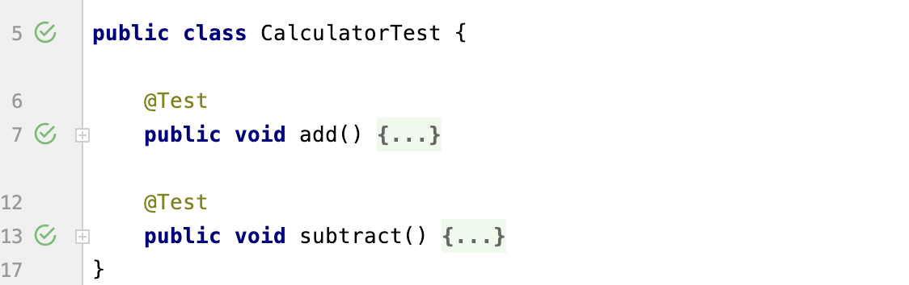

# 자바 웹 프로그래밍 Next Step
## 책을 읽는데 도움이 될 서적
1. 이펙티브 자바
2. 성공으로 이끄는 팀 개발 실천 기술(이케다 타카후미/김완섭 역)
   - 애플리케이션을 효과적으로 배포하고, 운영하기 위해 알아야 할 도구들과 각 도구들 간의 효과적인 활용 방법에 대해서 설명한다.
3. HTTP & Network : 그림으로 배우는 책으로 학습(우에노 센 저/이병억 역)
   - 웹 애플리케이션 개발자는 반드시 HTTP를 학습해야 한다. 
4. IT 인프라 구조 : 그림으로 공부하는(야마자키 야스시/김완섭 역)
   - 시스템과 운영체제, 서버와 아키텍처까지 전반적인 내용에 대해 이해할 수 있다.

## Ch2. 문자열 계산기 구현을 통한 테스트와 리팩토링
### Main()을 이용한 테스트의 문제점
1. 프로덕션 코드와 테스트 코드가 섞여버린다.
   - 테스트 코드는 서비스하는 시점에 같이 배포할 필요가 없다.
2. 프로덕션 코드의 복잡도가 증가할수록 main()메소드의 복잡도도 증가하고, 결과적으로 main() 메소드를 유지하는데 부담이 된다.
3. 콘솔에 출력된 값을 수동으로 체크해야 한다.

### Junit을 활용한 main() 메소드 문제점 극복
1. Junit을 사용하면 필요한 메소드에 대한 테스트만 할 수 있다. 

2. assertEquals() 메소드를 이용하여 실행 결과를 자동화하는 것이 가능하다.

~~~java
 @Test
 public void subtract() {
     Calculator cal = new Calculator();
     assertEquals(3, cal.subtract(6, 3));
 }
~~~

### 테스트 코드 중복 제거
중복을 제거하기 위해 Calculator를 생산하는 부분을 private 필드로 추출할 수 있다.

~~~java
public class CalculatorTest {

    private Calculator cal = new Calculator();
    
    @Test
    public void add() {
        assertEquals(9, cal.add(6, 3));
    }
    @Test
    public void subtract() {
        assertEquals(3, cal.subtract(6, 3));
    }
}
~~~

하지만 JUnit에서는 @Before 어노테이션을 활용해 다음과 같이 구현할 것을 추천한다.
~~~java
public class CalculatorTest {

    private Calculator cal;
    @BeforeEach
    public void setup() {
        cal = new Calculator();
    }

    @Test
    public void add() {
        assertEquals(9, cal.add(6, 3));
    }
    @Test
    public void subtract() {
        assertEquals(3, cal.subtract(6, 3));
    }
}
~~~
두 가지 모두 메소드를 실행할 때마다 새로운 객체를 생성한다는 점은 같다. 하지만 JUnit의 @RunWith, @Rule 같은 어노테이션을 사용하기 위해서는 @Before안이어야만 
접근할 수 있다는 제약사항이 있다. 

### 리팩토링
리팩토링이란 소스코드의 가독성을 높이고 유지보수를 편하게 하기 위해 소스코드의 구조를 변경하는 것을 의미한다. 다음 원칙을 지키려고 노력하면 일정 수준 깔끔한 코드 작성이 가능하다.
1. 메소드가 한 가지 책임만 가지도록 구현한다. 
2. 인덴트 깊이를 1단계로 유지한다.
   - 인덴트는 while 문과 if문을 사용할 경우 인덴트 깊이가 1씩 증가한다. 
   - 다음 소스코드의 인덴트 깊이는 2이다.

~~~java
void someMethod() {
    while(true) {
        if(true) {
            
        }
    }
}
~~~

3. else를 사용하지 마라. 프로그래밍을 구현할 때 else를 사용하지 않고 프로그래밍하는 것이 가능하다. 

### 추가학습 자료
1. 리팩토링 : 코드 품질을 개선하는 객체지향 사고법(마틴 파울러 저/김지원 역)
2. 정규식 : 손에 잡히는 정규 표현식 (벤 포터/김경수 역)

## Ch3. 개발 환경 구축 및 웹 서버 실습 요구사항
### 실습 3-1 : index.html 응답하기
1. BufferedReader를 이용한 데이터 읽기
 - 문자 인풋 스트림으로부터 데이터를 읽어오는 클래스
 - 데이터를 청크(chunk) 단위로 읽어옴으로써 I/O의 횟수를 줄일 수 있다. 읽어온 데이터 청크에 필요한 데이터가 있으면 버퍼에서 읽어온다.
 - 데코레이터 패턴을 사용하고 있다. 
      - 생성자의 파라미터로 Reader 인터페이스를 가지고 있다.
      - Reader의 모든 구현체를 파라미터로 받을 수 있기 때문에 유연하다.

2. HTTP 규약
 웹 클라이언트는 웹 서버와 데이터를 주고 받기 위해 HTTP라는 서로 간에 약속된 규약을 따른다. 

~~~text
POST /user/create HTTP/1.1                      ----> 요청 라인

HOST: localhost:8080                            ----> 요청 헤더
Connection-Length: 60                           ----> 요청 헤더
Content-Type: application/x-www-form-urlencoded ----> 요청 헤더
Accept: */*                                     ----> 요청 헤더

                                                ----> 헤더와 본문 사이의 빈 공백 라인
userId=java&password=password                   ----> 요청 본문
~~~

 - 요청 라인 : (HTTP 메소드 - 메소드 URI - HTTP 버전)으로 구성되어 있다. 
 - 요청 헤더 : <필드 이름> : <필드 값> 쌍으로 이루어져 있다.
 - 헤더와 본문 사이의 빈 공백을 통해 헤더와 본문을 구분짓는다. 

 응답 메세지의 표준 형태는 다음과 같다.

~~~text
HTTP/1.1 200 OK                               ----> 상태 라인 
Content-Type: text/html;charset=utf-8         ----> 요청 헤더
Content-Length: 20                            ----> 요청 헤더
                                              ----> 헤더와 본문 사이의 빈 공백
<h1>Hello World<h1>                           ----> 응답 본문
~~~
 -상태 라인 : (HTTP/버전 - 상태코드 - 응답구문)으로 구성되어 있다.

## Ch5. 웹 서버 리팩토링, 서블릿 컨테이너와 서블릿의 관계
현재까지 구현한 HTTP 웹 서버의 문제점은 다음과 같다.
1. HTTP 요청과 응답 헤더, 본문 처리와 같은 데 많은 시간 투자가 필요하다
2. 동적인 HTML을 지원하는데 한계가 있다. 
3. 사용자가 입력한 데이터가 서버를 재시작하면 사라진다.

1번 2번 문제를 해결하기 위해 서블릿 컨테이너와 서블릿/JSP를 사용할 수 있다.

### 서블릿
   서블릿은 앞에서 구현한 웹 서버의 Controller, HttpRequest, HttpResponse를 추상화해 인터페이스로 정의해 놓은 표준이다.
 - 서블릿은 Controller와 정확한 역할을 하며, 똑같은 방식으로 동작한다.
 - doGet() 메소드의 인자로 전달하는 HttpServletRequest, HttpServletResponse는 HttpRequest와 HttpResponse와 일치한다. 
 - Controller 인터페이스는 서블릿의 Servlet인터페이스, AbstractController는 HttpServlet과 같다. 

## Ch6. 서블릿/JSP를 활용해 동적인 웹 어플리케이션 개발하기
### 세션 요구사항 및 실습
   HTTP는 무상태 프로토콜로 클라이언트와 서버가 연결된 후 상태를 유지하지 않는다. 하지만 웹 애플리케이션은 로그인과 같이 상태를 유지해야하는 경우가 생긴다.
이와 같이 상태를 유지할 필요가 있을 때 사용할 수 있는 방법이 쿠키헤더를 사용할 수 있다. 하지만 쿠키는 웹 개발에 대한 약간의 관심이 있는 사람이라면 쉽게 분석해서 요청과 응답 헤더를 확인할 수 있다는 단점이 있다.
이런 쿠키의 단점을 보완하기 위해 세션을 사용할 수 있다. 세션은 상태 값으로 유지하고 싶은 정보를 클라이언트인 브라우저에 저장하는 것이 아니라 서버에 저장한다.  

## 추가 학습
### 로깅
자바에서는 메세지를 출력하기 위한 방법 중 하나로 System.out.println()을 사용한다. 하지만 이 방법은 메세지를 파일로 출력하기 때문에 비용이 높다. 이런 단점을 보완하기 위해
로깅 라이브러리를 사용할 수 있다. 
로그 레벨은 다음과 같다.
 - TRACE < DEBUG < INFO < WARN < ERROR

자바에서 문자열을 더하는 비용이 크기 때문에, 로깅 라이브러리는 동적인 메세지 구현을 위한 별도의 메소드를 제공한다.

~~~java
System.out.println("New Client Connect ! Connected IP " + con.getInetAddress() + " Port : " + con.getPort());

log.debug("New Client Connect! Connected IP: {}, Port : {}", con.getInetAddress(), con.getPort());
~~~

자세한 실습은 다음 링크에서 확인할 수 있다.
[실습 링크](../../logback/ReadMe.md)
