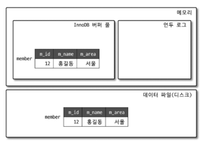

# 아키텍처
MySQL 서버는 사람의 머리 역할을 담당하는 **MySQL 엔진**과 손발 역할을 담당하는 **스토리지 엔진**으로 구분할 수 있다.

## MySQL 엔진
   클라이언트로부터의 접속 및 쿼리 요청을 처리하는 커넥션 핸들러와 SQL 파서 및 전처리기, 쿼리의 최적화된 실행을 위한 옵티마이저로 구성되어 있다.   

### 1. 핸들러 API
쿼리 실행기에서 데이터를 쓰거나 읽어야 할 때는 각 스토리지 엔진에 쓰기 또는 읽기를 요청하는데, 이러한 요청을 처리하는 API를 핸들러 API라고 한다.

### 2. MySQL 스레딩 구조 
MySQL 서버는 스레드 기반으로 작동하며, 포그라운드 스레드와 백그라운드 스레드로 구분할 수 있다.  

1. 포그라운드 스레드  
 -> 클라이언트가 MySQL 서버에 접속하면 서버는 클라이언트의 요청을 처리해 줄 스레드를 생성해 할당한다. 이 스레드는 DBMS 앞단에서 사용자와 통신하기 때문에
포그라운드 스레드라고 하며, 사용자가 요청한 작업을 처리하기 때문에 사용자 스레드라고도 한다.   
 -> 포그라운드 스레드는 데이터를 MySQL의 데이터 버퍼나 캐시로부터 가져오며, 
버퍼나 캐시에 없는 경우에는 직접 디스크의 데이터나 인덱스 파일로부터 데이터를 읽어와서 작업을 처리한다.   

2. 백그라운드 스레드  
InnoDB는 여러 가지 작업이 백그라운드로 처리된다.
1 ) 인서트 버퍼를 병합하는 스레드  
2 ) 로그를 디스크로 기록하는 스레드 
3 ) InnoDB 버퍼 풀의 데이터를 디스크에 기록하는 스레드 
4 ) 데이터를 버퍼로 읽어 오는 스레드 
5 ) 잠금이나 데드락을 모니터링하는 스레드 
쓰기 스레드는 아주 많은 작업을 백그라운드로 처리하기 때문에 충분한 수의 스레드를 할당하는 것이 좋으며, 쓰기 작업은 지연(버퍼링)되어 처리될 수 있다.   

### 3. 메모리 할당 및 사용 구조  
MySQL에서 사용되는 메모리 공간은 스레드가 공유해서 사용하는 공간인지 여부에 따라 `글로벌 메모리 영역`과 `로컬 메모리 영역`으로 구분된다.  
  
[글로벌 메모리 영역]  
클라이언트 스레드의 수와 무관하게 하나의 메모리 공간만 할당된다.  
   &nbsp;&nbsp;&nbsp;1 ) 테이블 개시 
   &nbsp;&nbsp;&nbsp;2 ) InnoDB 버퍼 풀 
   &nbsp;&nbsp;&nbsp;3 ) InnoDB 어댑티브 해시 인덱스 
   &nbsp;&nbsp;&nbsp;4 ) InnoDB 리두 로그 버퍼  
[로컬 메모리 영역]  
클라이언트 스레드가 쿼리를 처리하는 데 사용하는 메모리 영역이다. 클라이언트와 MySQL 서버와의 커넥션을 세션이라고 하기 때문에 세션 메모리 영역이라고도 표현한다. 
로컬 메모리는 각 클라이언트 스레드별로 독립적으로 할당되며 절대 공유되어 사용되지 않는다. 
   &nbsp;&nbsp;&nbsp;1 ) 커넥션 버퍼  
   &nbsp;&nbsp;&nbsp;2 ) 정렬 버퍼  

### 4. 플러그인 스토리지 엔진 모델  
MySQL는 다른 DBMS과 달리 플러그인 모델 구조를 가지고 있다. 기본적으로 많은 스토리지 엔진을 가지고 있지만, 사용자의 요구 조건을 만족시키기 위해
사용자가 직접 스토리지 엔진을 개발하는 것도 가능하다.
MySQL에서 쿼리가 실행되는 과정을 보면 대부분의 작업이 MySQL 엔진에서 처리되고, '데이터 읽기/쓰기' 작업에만 스토리지 엔진이 사용된다.  
  
MySQL 엔진은 각 스토리지 엔진에게 데이터를 읽어오거나 저장하도록 명령하기 위해 핸들러를 이용한다.   
MySQL에서는 스토리지 엔진뿐만 아니라 다양한 기능을 플러그인 형태로 지원한다.
인증이나 전문 검색 파서 또는 쿼리 재작성과 같은 플러그인이 있으며, 비밀번호 검증과 커넥션 제어 등에 관련된 다양한 플러그인이 제공된다.   

### 5. 컴포넌트  
MySQL 서버 플러그인은 다음과 같은 단점이 있다.  
   &nbsp;&nbsp;&nbsp;1 ) 플러그인은 오직 MySQL 서버와 인터페이스할 수 있고, 플러그인끼리는 통신할 수 없다.  
   &nbsp;&nbsp;&nbsp;2 ) 플러그인은 MySQL 서버의 변수나 함수를 직접 호출하기 때문에 안전하지 않다.  
   &nbsp;&nbsp;&nbsp;3 ) 플러그인은 상호 의존 관계를 설정할 수 없어서 초기화가 어렵다  
이러한 문제를 해결하기 위해 컴포넌트가 등장했다.  

### 6. 쿼리 실행 구조 
 
   &nbsp;&nbsp;&nbsp;1 ) 쿼리 파서 : 사용자 요청으로 들어온 쿼리 문장을 MySQL이 인식할 수 있는 토큰으로 분리해 트리 형태의 구조로 만들어 내는 작업을 한다. 쿼리 문장의 기본 문법 오류는 이 과정에서 발견된다.  
   &nbsp;&nbsp;&nbsp;2 ) 전처리기 : 파서 과정에서 만들어진 파서 트리를 기반으로 쿼리 문장에 구조적인 문제점이 있는지 확인한다. 각 토큰을 테이블 이름이나 칼럼 이름, 내장 함수와 같은 개체를 매핑해 해당 객체의 존재 여부와 객체의 접근 권한 등을 확인한다.  
   &nbsp;&nbsp;&nbsp;3 ) 옵티마이저 : 사용자의 요청으로 들어온 쿼리 문장을 어떻게 저렴한 비용으로 가장 빠르게 처리할지를 결정하는 역할을 담당한다.  
   &nbsp;&nbsp;&nbsp;4 ) 실행 엔진 : 옵티마이저가 두뇌라면 실행 엔진과 핸들러는 손과 발에 비유할 수 있다. 옵티마이저가 실행 계획을 세우면 그 계획대로 각 핸들러에게 요청해서 받은 결과를 또 다른 핸들러 요청의 입력으로 연결하는 역할을 한다.  
   &nbsp;&nbsp;&nbsp;5 ) 핸들러(스토리지 엔진) : MySQL 실행 엔진의 요청에 따라 데이터를 디스크로 저장하고 읽어 오는 역할을 담당한다.  
   &nbsp;&nbsp;&nbsp;6 ) 쿼리 캐시(8.0에서 제거됨) : SQL의 실행 결과를 메모리에 캐시하고, 
동일 sql 쿼리가 실행되면 테이블을 읽지 않고 즉시 결과를 반환하기 때문에 빠른 성능을 보여줬다. 
쿼리 캐시는 테이블의 데이터가 변경되면 캐시에 저장된 결과 중에서 변경된 테이블과 관련된 것들은 모두 삭제해야 했고 이는 심각한 동시 처리 성능 저하와 버그를 유발해 8.0 버전 이후에는 삭제되었다.  
   &nbsp;&nbsp;&nbsp;7 ) 스레드 풀 : MySQL 서버의 CPU가 제한된 개수의 스레드 처리에만 집중할 수 있게 해서 서버의 자원 소모를 줄이는 것이 목적이다.
스케줄링 과정에서 CPU 시간을 제대로 확보하지 못하는 경우에는 쿼리 처리가 더 느려지기 때문에 스케줄링 과정에서 CPU시간을 확보하는 것이 중요하다.  
스레드 풀의 모든 스레드가 일을 처리하고 있다면 어떤식으로 처리 될까?
=> 스레드 풀의 타이머 스레드는 주기적으로 스레드 그룹의 상태를 체크해서 시스템 변수에 정의된 시간만큼 작업을 끝내지 못하면 새로운 스레드를 생성해서 스레드 그룹에 추가한다. 

---

## 스토리지 엔진
   요청된 SQL 문장을 분석하거나 최적화하는 등 DBMS의 두뇌에 해당하는 처리를 수행하고, 
   실제 데이터를 디스크 스토리지에 저장하거나 디스크 스토리조부터 데이터를 읽어오는 역할을 담당한다.

MySQL 서버에서 MySQL 엔진은 하나지만 스토리지 엔진은 여러 개를 동시에 사용할 수 있다. 
다음은 InnoDB 스토리지 엔진이 test_table에 대해 crud 작업을 담당하게 된다.
~~~sql
CREATE TABLE test_talbe (fd1 INT, fd2 INT) ENGINE=INNODB;
~~~

각각의 스토리지 엔진은 성능 향상을 위해 `키 캐시(MyISAM 스토리지 엔진)`나 `InnoDB 버퍼 풀`과 같은 기능을 내장하고 있다.

### InnoDB 스토리지 엔진
  

#### 1. 프라이머리 키에 의한 클러스터링
InnoDB의 모든 테이블은 PK 값 순서대로 디스크에 저장되며, 모든 세컨더리 인덱스는 레코드의 주소 대시 PK의 값을 논리적인 주소로 사용한다.

#### 2. MVCC(Multi Version Concurrency Control) 
잠금을 사용하지 않는 일관된 읽기를 제공하기 위해 InnoDB 언두 로그(Undo log)를 이용한다. 
멀티 버전이란 하나의 레코드에 대해 여러 개의 버전이 동시에 관리된다는 의미다. 

InnoDB를 사용했을 때 테이블의 데이터 변경이 어떻게 이루어지는지 확인해보자.  
`INSERT INTO member (id, name, area) VALUES (15, '바닐라', '왕국')`  
  

`UPDATE member SET area = '아이스크림' WHERE id = 15;`  
  
1. UPDATE 문장이 실행되면 커밋 실행 여부와 관계없이 버퍼 풀은 새로운 값으로 업데이트 되며, 이전 값은 언두 영역에 보관된다. (디스크의 데이터 파일에는 업데이트 돼 있을 수 있고 아닐 수 있다.)
2. COMMIT이나 ROLLBACK이 되지 않은 상태에서 사용자를 조회하면 어떤 데이터를 가져올까?  
 => 이는 MySQL 서버에 설정한 격리 수준에 따라 다르다.   
 => READ_UNCOMMITED인 경우에는 InnoDB 버퍼 풀이 현재 가지고 있는 변경된 데이터를 읽어서 반환한다.   
 => READ_COMMITED이상의 격리 레벨은 변경되기 이전의 내용을 보관하고 있는 언두 영역의 데이터를 반환한다.  
3. 롤백을 실행하면 InnoDB는 언두 영역에 있는 백업된 데이터를 InnoDB 풀로 다시 복구하고, 언두 영역의 내용을 삭제한다. 
4. 언두 영역의 데이터는 언두 영역을 필요로 하는 트랜잭션이 없을 때 삭제된다.   

InnoDB의 언두 로그를 이용하면 잠금 없는 일관된 읽기가 가능하다. 격리 수준이 SERIALIZABLE이 아닌 격리 레벨에서는 INSERT와 연결되지 않은 순수한 읽기 작업은 
다른 트랜잭션의 변경 작업과 관계없이 항상 잠금을 대기하지 않고 바로 실행한다. 

#### 3. 자동 데드락 감지
InnoDB 스토리지 엔진은 데드락 감지 스레드를 가지고 있어서 데드락 감지 스레드가 주기적으로 잠금 대기 그래프를 검사해 교착 상태에 빠진 트랜잭션들을 찾아서 그 중 하나를 강제 종료한다.
이 때, 트랜잭션은 언두 로그 레코드를 더 적게 가진 트랜잭션이 일반적으로 롤백의 대상이 된다. 

동시 처리 스레드가 매우 많아지는 경우 각 트랜잭션이 가진 잠금의 개수가 많아지면 데드락 감지 스레드가 느려진다. 데드락 감지 스레드는 잠금 목록을 검사해야 하기 때문에 잠금 상태가 변경되지 않도록
잠금 목록이 저장된 리스트에 새로운 잠금을 걸고 데드락 스레드를 찾는다. 이렇게 동시 처리 스레드가 매우 많은 경우 데드락 감지 스레드는 더 많은 CPU 자원을 소모할 수도 있다.

#### 4. 자동화된 장애 복구 
InnoDB에는 손실이나 장애로부터 데이터를 보호하기 위한 여러 가지 메커니즘이 탑재되어 있다. 이런 메커니즘을 이용해 MySQL 서버가 시작될 때 완료되지 못한 트랜잭션이나 디스크에 일부만 기록된 
데이터 페이지 등에 대한 일련의 복구 작업이 자동으로 이루어진다. 

MySQL 서버와 무관하게 디스크나 서버 하드웨어 이슈로 InnoDB 스토리지 엔진이 자동으로 복구를 못 하는 경우도 발생할 수 있는데, 이 때는 책 105p를 참고하여 최대한 데이터를 복구하는 것이 중요하다.

#### 5. InnoDB 버퍼 풀
InnoDB에서 가장 중요한 부분으로 디스크의 데이터 파일이나 인덱스 정보를 메모리에 캐시해 두는 공간이다. 쓰기 작업을 지연시켜 일괄 작업으로 처리할 수 있게 해주는 버퍼 역할도 같이 한다.

그렇다면 버퍼 풀의 크기는 어떤 기준으로 설정해야 할까?  
 => 운영체제의 전체 메모리 공간이 8GB 미만이라면 50% 정도만 InnoDB 버퍼 풀로 설정하고 나머지 메모리 공간은 MySQL 서버와 운영체제
그리고 다른 프로그램이 사용할 수 있는 공간으로 확보해주는 것이 좋다. 만약 전체 메모리가 8GB이상이라면 50%에서 시작해서 조금씩 올려가면서 최적점을 찾는다. 
운영체제의 전체 메모리 공간이 50GB 이샹이라면, 대략 15GB ~ 30GB 정도를 운영체제와 다른 응용 프로그램을 위해 남겨두고 나머지를 InnoDB 버퍼 풀로 할당하자.

[버퍼 풀의 구조]  
InnoDB 버퍼 풀은 내부적으로 128MB 청크 단위로 쪼개어 InnoDB 스토리지 엔진이 데이터를 필요로 할 때 해당 데이터의 페이지를 읽어서 각 조각에 조장한다.

InnoDB 스토리지 엔진은 크게 LRU(Least Recently Used) 리스트와 FLUSH 리스트, FREE 리스트 3가지 자료 구조를 관리한다. 
1. 프리 리스트는 InnoDB 버퍼 풀에서 실제 사용자 데이터로 채워지지 않은 비어 있는 페이지들의 목록이며, 새롭게 디스크의 데이터 페이지를 읽어와야 하는 경우 사용된다.
2. LRU 리스트는 한 번 읽어온 페이지를 최대한 오랫동안 InnoDB 버퍼풀의 메모리에 유지해서 디스크 읽기를 최소화 할 수 있도록 한다.  
  
 => 필요한 레코드가 저장된 페이지가 버퍼 풀에 있는지 검사   
 => 디스크에 필요한 데이터 페이지를 버퍼 풀에 적재하고, 적재된 페이지에 대한 포인터를 LRU 헤더 부분에 추가한다. 
 => 버퍼 풀이 LRU 헤더 부분에 적재된 페이지가 실제로 읽히면 MRU 헤더 부분으로 이동 => 버퍼 풀에 상주하는 데이터 페이지는 사용자 쿼리가 얼마나 최근에 접근했었는지에 따라 나이가 부여되며 
오랫동안 사용되지 않으면 버퍼 풀에서 제거 된다. 버퍼 풀이 데이터 페이지가 사용되면 나이가 초기화 되어 다시 젊어지고 MRU의 헤더 부분으로 옮겨진다.  
=> 필요한 데이터가 자주 접근됐다면 해당 페이지의 인덱스 키를 어댑티브 해시 인덱스에 추가한다.

[버퍼 풀과 리두 로그]  
InnoDB 버퍼 풀은 데이터베이스 서버의 성능 향상을 위해 데이터 캐시와 쓰기 버퍼링 기능을 제공한다. 단순히 메모리 공간을 늘리면 데이터의 캐시 기능을 향상시킬 수 있다.
하지만 버퍼 풀의 쓰기 버퍼링 기능까지 향상시키려면 InnoDB 버퍼 풀과 리두 로그와의 관계를 이해해야 한다.  
  

InnoDB의 버퍼 풀은 디스크에서 읽은 상태로 전혀 변경되지 않은 클린 페이지와 INERT, UPDATE, DELETE 명령으로 변경된 데이터를 가진 더티 페이지를 가지고 있다.
더티 페이지는 디스크와 메모리(버퍼 풀)의 데이터 상태가 다르기 때문에 언제가는 디스크로 기록되어야 한다. 하지만 이런 더티 페이지는 데이터 변경이 발생할 때 마다 새로운 로그 엔트리로 덮어 써진다.
따라서 리두 로그 파일에서 재사용 가능 공간과 재사용 불가능한 공간(활성 리두 로그)을 구분해서 관리 해야 한다. 그림에서는 화살표를 가진 엔트리들이 활성 리두 로그 공간이다.

리두 로그 파일의 공간은 계속 순환되어 재사용되지만, 매번 기록될 마다 로그 포지션은 증가된 값을 갖게 된다. 이를 LSN(Log Sequence Number)이라고 한다.
InnoDB 스토리지 엔진은 주기적으로 체크포인트 이벤트를 발생시켜 리두 로그와 버퍼 풀의 더티 페이지를 디스크로 동기화하며, 이렇게 발생한 체크포인트 중 가장 최근 체크포인트 지점의 LSN이
활성 리두 로그 공간의 시작점이 된다. 가장 최근 체크포인트의 LSN과 리두 로그 엔트리의 LSN의 차리를 체크 포인트 에이지라고 하며, 이는 활성 리두 로그 공간의 크기를 일컫는다.

[Double Write Buffer]  
InnoDB 스토리지 엔진의 리두 로그는 리두 로그 공간의 낭비를 최소화 하기 위해 페이지의 변경된 내용만 기록한다. 이로 인해 하드웨어의 오작동이나 시스템의 빙정상 종료 등이 발생했을 때,
InnoDB의 스토리지 엔진에서 더티 페이지를 디스크 파일로 플러시할 때 일부만 기록되는 문제가 발생하면 복구할 수 없어진다.

이러한 현상을 막기 위해 Double-Write 기법을 이용한다.
  
1. 스토리지 엔진은 실제 데이터 파일에 변경 내용을 기록하기 전에 'A' ~ 'E'까지의 더티 페이지를 우선 묶어서 한 번의 디스크 쓰기로 시스템 테이블스페이스의 DoubleWrite 버퍼에 기록한다.
2. 스토리지 엔진은 각 더티 페이지를 파일의 적당한 위치에 하나씩 랜덤으로 쓰기를 실행한다. 

#### 6. 언두 로그
InnoDB 스토리지 엔진은 트랜잭션과 격리 수준을 보장하기 위해 DML(INSERT, UPDATE, DELETE)로 변경되기 이전 버전의 데이터를 별도로 백업한다. 이렇게 백업된 데이터를 언두 로그라고 한다.
언두 로그는 다음과 같은 역할을 담당한다.
1. 트랜잭션 보장 : 트랜잭션이 롤백되면 데이터를 변경 전 데이터로 복구해야 하는데, 이때 언두 로그에 백업해둔 이전 버전의 데이터를 이용해 복구한다.
2. 격리 수준 보장 : 특정 커넥션에서 데이터를 변경하는 도중에 다른 커넥션에서 데이터를 조회하면 트랜잭션 격리 수준에 맞게 변경 중인 레코드를 읽지 않고 언두 로그에 백업해둔 데이터를 읽어서 반환한다.

[언두 로그 레코드 모니터링]  
1. 대용량 데이터 처리
 - MySQL 5.5 이전 버전에서는 한 번 증가한 언두 로그 공간은 줄어들지 않았다. 예를 들어 1만 건의 레코드가 저장된 10G 크기의 테이블을 DELETE 하면, 삭제하기 전에 1만 건이 언두 영역에 복사되고
이 복사된 언두 영역은 삭제 되지 않는다.
 - MySQL 8.0이상부터는 언두 로그를 돌아가면서 순차적으로 사용해 디스크 공간을 줄이는 것도 가능하며, 때로는 Mysql서버가 필요한 시점에 사용 공간을 자동으로 줄여 주기도 한다.

2. 긴 트랜잭션 시간 
 - 트랜잭션이 완료됐다고 해서 해당 트랜잭션이 생성한 언두 로그를 즉시 삭제할 수 없다.
 - 관련 데이터의 모든 트랜잭션이 종료될 때 까지 언두 로그는 삭제되지 않고 대기된다.  
     
 - 트랜잭션 B,C는 끝났지만, A의 트랜잭션이 끝날 때 까지 언두 로그는 삭제될 수 없다. 
 - `SHOW ENGINE INNODB STATUS \G`를 통해 서버의 언두 로그 레코드 건수를 확인할 수 있다.

