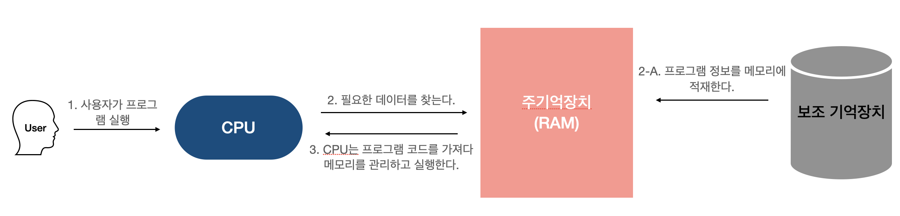
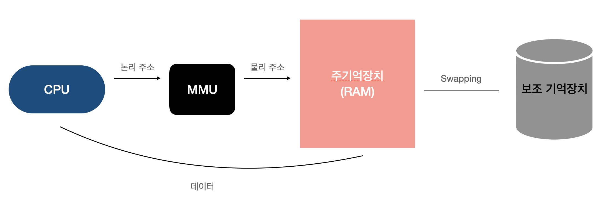
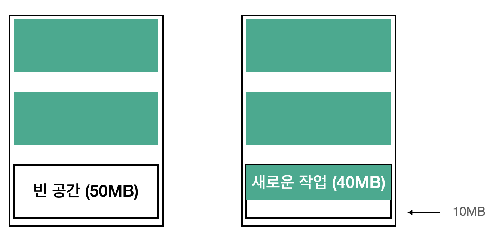
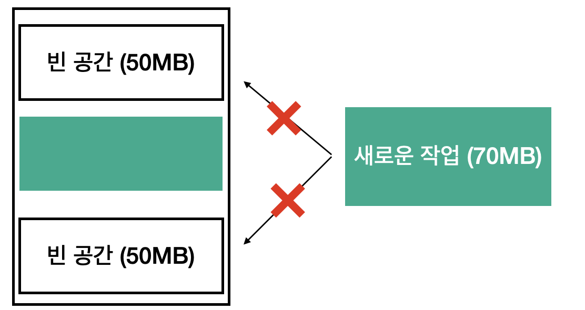

# 메모리
### 프로세스에 할당되는 메모리의 각 영역
프로세스의 주소 공간은 코드, 데이터, 스택 힙 영역으로 구성된다.
이렇게 나눔으로써 데이터를 공유할 수 있게 되고 메모리 사용량이 줄어든다.
1. 코드 영역 : 사용자가 작성한 프로그램 함수 코드가 CPU에서 수행할 수 있는 기계어 명령 형태로 변환되어 저장되는 공간 (컴파일 타임에 결정되며, 읽을 수만 있다.)
2. 데이터 영역 : 전역 변수 또는 static 변수 등 프로그램이 사용하는 데이터를 저장하는 공산
3. 스택 영역 : 호출된 함수의 수행을 마치고 복귀할 주소 및 데이터(지역변수, 매개변수, 리턴값 등)을 임시로 저장하는 공간.
4. 힙 영역 : 프로그래머가 필요할 때마다 사용하는 메모리 영역으로 런타임 시점에 결정된다. 

### 메모리 구조의 순서 (CPU에서 가까운 순으로 나열해보기)
레지스터 -> 캐시(SRAM) -> 메인 메모리(DRAM) -> 하드 디스크
 * DRAM(Dynamic RAM) : 커패시터로 작동하기 때문에 시간이 지나면 스스로 방전 되기 때문에 데이터가 휘발된다. 
따라서 주기적으로 재충전 해주어야 한다. 실제로 Refresh라는 과정을 통해 캐패시터에 전하를 채우는 과정이 있다.
 * SRAM(Static RAM) : 재충전하지 않아도 전원이 켜져 있는 상태면 데이터가 휘발하지 않는다.

### 프로그램 실행 과정
프로그램이 실행되려면 메모리에 프로그램이 적재되어야 한다. 프로그램을 실행하면 아래 그림처럼 동작한다.
1. 사용자가 프로그램을 실행하면 CPU는 레지스터의 명령을 받아 메모리에 접근하여 필요한 데이터를 가져온다. 이 때 메모리에 필요한 데이터가 없으면 데이터를 가져와야 한다.  
 1-A. 메인 메모리는 공간이 한정되어 있기 때문에 '가상 주소'라는 것을 사용하는데 이 가상 주소를 실제 데이터가 담겨 있는 곳으로 접근하기 위한 변환하여 데이터를 가져온다.
2. CPU는 메인 메모리에 적재된 데이터를 가져와 프로그램을 실행한다.

#### 가상 주소와 MMU
메인 메모리에 필요한 데이터가 없으면 이를 가져와야 한다고 했다. 메인 메모리는 공간이 한정되어 있기 때문에 이를 극복하기 위해 '가상 주소'를 이용하고 있다.
따라서 가상 주소를 실제 주소로 바꾸는 과정이 필요하며, 이를 도와주는 것이 MMU이다.

### 내부 단편화와 외부 단편화
메모리에 프로그램이 적재되고 내려가는 과정에서 내부 단편화와 외부 단편화가 발생한다.
#### 내부 단편화 
   메모리 할당시 프로그램이 필요한 양보다 더 큰 메모리가 할당되어서 프로세스에서 사용하는 메모리 공간이 낭비 되는 현상
아래 그림에서는 10MB의 메모리 공간이 낭비되게 된다.

#### 외부 단편화
   메모리가 할당 및 해제 작업의 반복으로 작은 메모리가 중간중간 존재하게 된다. 중간중간 빈 메모리를 다 합치면 매우 크지만 실제로는 할당 될 수 없는 상황

#### 메모리 단편화를 해결하는 방법
1. 페이징  
 -> 프로세스를 **일정한** 크기의 페이지로 분할해서 메모리에 적재하는 방식이다.   
 -> 논리 메모리는 물리 메모리에 저장될 때 연속되어 저장될 필요가 없고, 물리 메모리는 남는 프레임에 적절히 배치되기 때문에 외부 단편화가 생기지 않는다.  
 -> 하지만 내부 단편화 문제가 발생할 수 있다. 페이지 단위를 작게하면 해결할 수 있지만, 페이지 맵핑 과정이 복잡해셔 오히려 비효율적이다.

2. 세그먼테이션  
 -> 가상 메모리를 서로 **크기가 다른** 논리적 단위로 분할한 방식  
 -> 내부 단편화 문제가 해소되지만, 메모리에 적재되고 제거되는 일이 반복되다 보면, 외부 단편화 문제가 발생한다. 

페이징은 파일을 보관할 때 일정한 크기로 분리하지만, 세그먼테이션은 주제 별로 각기 다른 크기로 저장한다.

### 페이징 교체 알고리즘
1. FIFO(First In First Out)   
 -> 가장 먼저 메모리에 올라온 페이지를 가장 먼저 내보낸다.  
 -> 구현은 간단하지만 성능이 좋지 않다.
2. OPT(Optimal)  
 -> 앞으로 가장 오랫동안 사용하지 않을 페이지를 교체하는 알고리즘 
 -> 실질적으로 어떤 페이지가 앞으로 오랫동안 사용되지 않을 지 알 수 없기 때문에 수행하기 어렵다.
3. LRU(Least Recently Used)  
 -> 가장 오랫동안 사용하지 않은 페이지를 교체하는 알고리즘
 -> 성능이 좋다.
4. LFU(Least Frequently Used) 
 -> 메모리에 적재되어 있는 페이지들에 대한 참조된 횟수를 기준으로 횟수가 가장 적은 페이지를 교체한다.
 -> 횟수에 의한 방법으로 가장 최근에 사용된 프로그램을 교체시킬 가능성이 있고, 해당 횟수를 증사키므로 오버헤드가 발생한다.
5. LRU(Least Recently Used) 
 -> 참조 횟수가 가장 많은 페이지를 교체하는 알고리즘
 -> 횟수에 의한 방법으로 해당 횟수를 증사키므로 오버헤드가 발생한다.