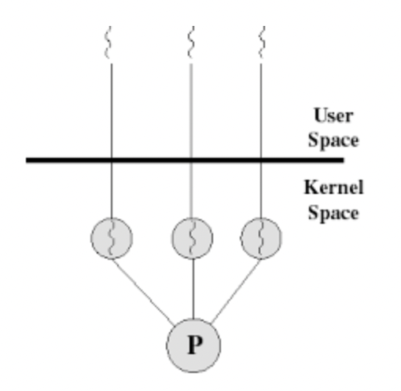
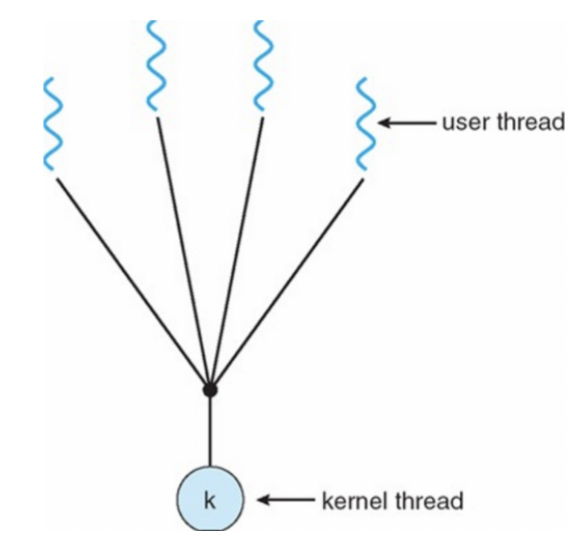
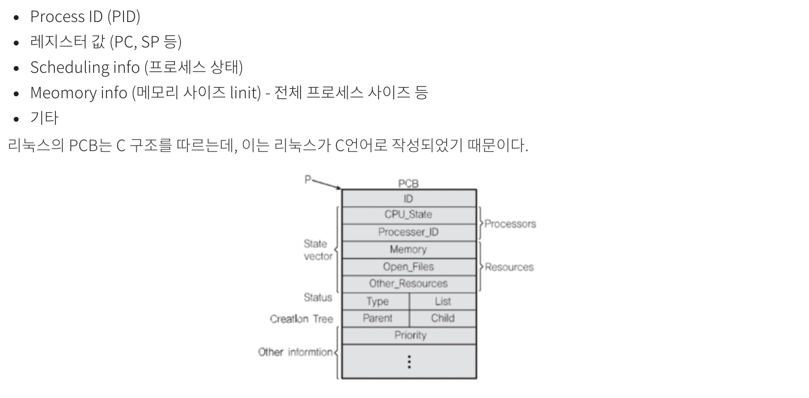

# 운영체제
## 프로세스와 스레드의 차이
프로세스는 실행될 때 운영체제로부터 필요한 주소 공간, 메모리 등 자원을 할당 받는다.
스레드는 이런 프로세스 내에서 동작되는 여러 실행의 흐름으로 프로세스 내의 주소 공간이나 자원들을 
같은 프로세스 내에 스레드끼리 공유하면서 실행된다. 

### 멀티 프로세스로 vs 멀티 쓰레드
시스템 자원을 효율적으로 관리하기 위해서 쓰레드를 사용한다.
1. 멀티 스레드로 실행할 경우, 프로세스를 생성해서 자원을 할당하는 작업이 줄어든다.
2. 프로세스 간의 통신보다 스레드 간의 통신 비용이 적다. 

## 경쟁 상태와 스레드 동기화
### 경쟁 상태
공유 자원에서 여러 프로세스, 스레드가 동시에 접근할 때, 결과값에 영향을 줄 수 있는 상태를 말한다. 이를 해결하기 위해 공유 자원의 독점을 보장해주어야 한다.
1. 상호배제 : 한 프로세스가 임계영역에 있으면 다른 프로세스들은 접근할 수 없다.
2. 진행 : 프로세스가 임계영역에 없다면 대기하고 있는 임계영역을 진입하게 해준다.
3. 유한대기 : 임계영역에 들어가기 위해서 무한 대기가 아닌 유한 대기를 한다. 

### 스레드 동기화
멀티 스레드를 이용하는 프로그램에서 스레드 2개 이상이 공유 자원에 동시에 접근할 때 발생하는 문제를 해결하기 위한 일련의 작업  
Ex ) 같은 은행 계좌에 동시 접근하여 출금을 하는 경우 계좌 잔액보다 더 많은 돈이 인출될 수 있다.  

이를 해결하기 위해 뮤텍스와 세마포어를 이용할 수 있으며 자바에서는 synchronized를 이용하여 스레드 동기화할 수 있다. 
~~~java
public synchronized void withdraw(int money) {}
~~~

---

## 뮤텍스와 세마포어
### 임계 구역
서로 다른 두 프로세스, 혹은 스레드 등의 처리 단위가 같이 접근해서는 안 되는 공유 영역을 말한다. 보호되지 않은 임계 구역에서 여러 스레드가 같은 자원에 동시에 접근할 때
발생하는 문제를 '임계 구역 문제'라고 한다.  
이런 임계 구역 문제를 해결하는 방법으로 뮤텍스와 세마포어가 있다.

### 뮤텍스
키를 기반으로 한 상호 배제 기법이다. 화장실이 하나만 있는 식당에서 화장실을 이용하기 위해 키를 사용하면, 다른 사람들은 키를 사용하고 있는 사용자가 이를 반납할 때 까지 줄을 서서 기다려야 한다.

### 세마포어
카운트를 기반으로 한 상호 배제 기법이다. 화장실이 여러개가 있고 문이 열려있으면 이를 이용하고, 닫혀 있으면 줄을 서서 기다리는 형태이다.

---

## 교착상태
### 교착상태란? 
두 개 이상의 프로세스가 자원을 점유한 상태에서 서로 다른 프로세스가 점유하고 있는 자원을 요규하며, 서로의 작업을 끝나기만을 기다리는 상황을 말한다.

### 교착상태가 발생하기 위한 4가지 조건
1. 상호배제 : 한 번에 한 개의 프로세스만이 공유자원을 사용할 수 있다. 
2. 점유대기 : 프로세스가 할당된 자원을 가진 상태에서 다른 자원을 기다린다.
3. 비선점 : 프로세스가 작업을 마친 후 자원을 자발적으로 반환할 때까지 기다린다.
4. 순환대기 : 프로세스의 자원 점유 및 점유된 자원의 요구 관계가 원형을 이루면서 대기한다. 즉, 각 프로세스는 순환적으로 다음 프로세스가 요구하는 자원을 가지고 있다. 

### 교착상태를 해결하는 방법
1. 상호배제 부정 : 여러 개의 프로세스가 동시에 공유자원을 사용할 수 있게 한다.
2. 점유 대기 부정 : 프로세스가 실행되기 전에 필요한 모든 자원을 할당하여 프로세스 대기를 없에거나, 자원이 점유되지 않은 상태에서만 자원 요청을 받도록 한다.
3. 비선점 부정 : 모든 자원에 대한 선점을 허용한다.
4. 순환 대기 부정 : 자원을 선형으로 분류하여 고유 번호를 할당하고, 각 프로세스는 현재 점유한 자원의 고유번호보다 앞이나 뒤 한쪽 방향으로만 자원을 요구하도록 한다.

---

## 사용자 수준 쓰레드와 커널 수준 쓰레드
 * 커널이란 운영체제의 핵심부로써 컴퓨터의 자원들을 관리하며, 하드웨어와 응용 프로그램 사이에서 인터페이스를 제공하는 역할을 한다.
~~~text
컴퓨터
 |----- 하드웨어
 |----- 소프트웨어
           |--------- 응용 프로그램
           |--------- 운영체제 (OS)
                        |---------- 시스템 프로그램
                        |---------- 커널
                       
~~~

### 커널 수준 쓰레드
커널 레벨에서 생성되는 스레드로 운영체제 시스템 내에서 생성되어 자원을 할당 받고 주기억 장치에 적재되어 CPU 할당을 기다리며 동작한다.
CPU에서 인터럽트가 발생하면 컨텍스트 스위칭 비용이 들지만, 커널이 직접 관리하므로 특정 스레드가 block이 되어도 다른 스레드에는 영향을 안준다는 장점이 있다.

   
입출력 인터럽트가 발생하면 커널은 사용자 모드가 되어 사용자 수준 스레드의 응답을 받고 커널 모드로 변환하여 커널 스레드가 이를 처리 한다. 이를 커널 수준 쓰레드라고 한다. 

### 사용자 수준 쓰레드
스레드를 관리하는 라이브러리로 인해 생성되는 스레드로 커널이 관리하지 않는다.
자바에서 멀티 쓰레드로 프로그래밍 하듯이, 같은 함수 내에서 쓰레드가 추가적으로 연산을 처리한다고 생각하면 될 것 같다.
여기서는 쓰레드 하나가 block이 되면 모든 쓰레드가 block이 된다. 

 

#### 컨텍스트 스위칭
어떤 하나의 프로세스를 실행하고 있는 상태에서 인터럽트 요청에 의해 새로운 프로세스가 실행되어야 할 때, 기존의 프로세스 상태를 저장하고 새로운 프로세스의 상태값으로 교체하는 작업을 말한다.
컨텍스트 스위칭은 PCB(Process Context/Control Block)이라고 하는 메모리의 별도 공간에 프로세스 상태값들을 저장하고, 해당 값들을 찾는 방법으로 구현된다.  
 

