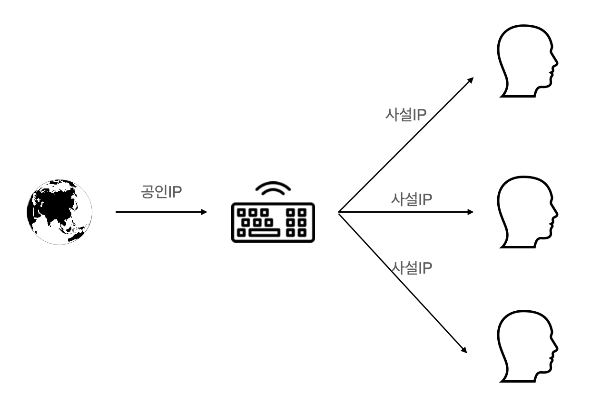

## IP
IP란 인터넷에 연결되어 있는 장치들을 식별할 수 있도록 각각의 장비에게 부여되는 주소이다.

### 고정 IP와 유동 IP
1. 고정 IP  
장치에 고정적으로 부여된 IP로 보안성이 좋아 높은 보안이 필요한 기관에서 사용한다.

2. 유동 IP  
고정 IP를 모든 사용자에게 할당할 수 없기 때문에, 일정한 주기로 인터넷에 접속하는 순간에 사용하고 있지 않은 IP 주소를 임시로 발급해준다.

### 공인 IP와 사설 IP
IP 주소는 전 세계적으로 ICNN이라는 기관이 국가별로 사용할 IP 대역을 관리하고 있으며, 우리나라는 한국인터넷진흥원에서 국내 IP 주소들을 관리하고 있다.

이것을 KT, LG, SKT와 같은 ISP(Internet Service Provier)업체가 부여받고 사용자에게 IP를 제공해준다. 
이렇게 발급받은 IP를 **공인 IP**라고 한다.   

공유기를 사용한 인터넷 접속 환경일 경우 공유기에는 공인IP를 할당 하지만, 공유기에 연결되어 있는 가정이나 회사의 각 네트워크 기기에는 사설 IP를 할당한다.
**사설 IP**는 특정 네트워크 안에서 내부적으로 사용되는 고유한 주소이다. 즉, 공인IP는 전 세계에서 유일하지만, 사설 IP는 하나의 네트워크(공유기) 안에서 유일하다.  

[참고](https://study-recording.tistory.com/7)