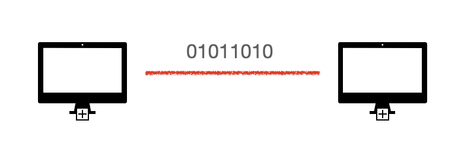
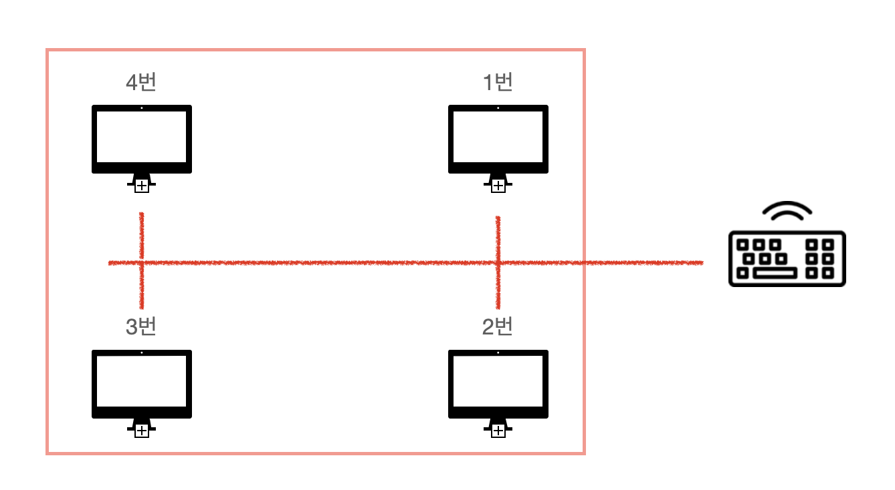
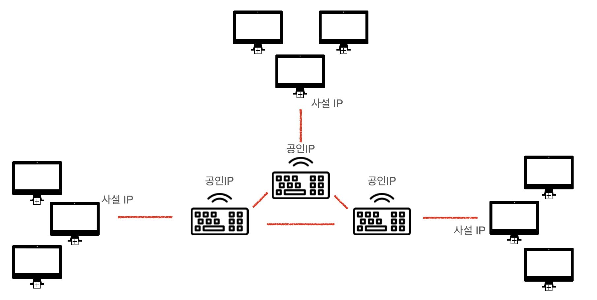
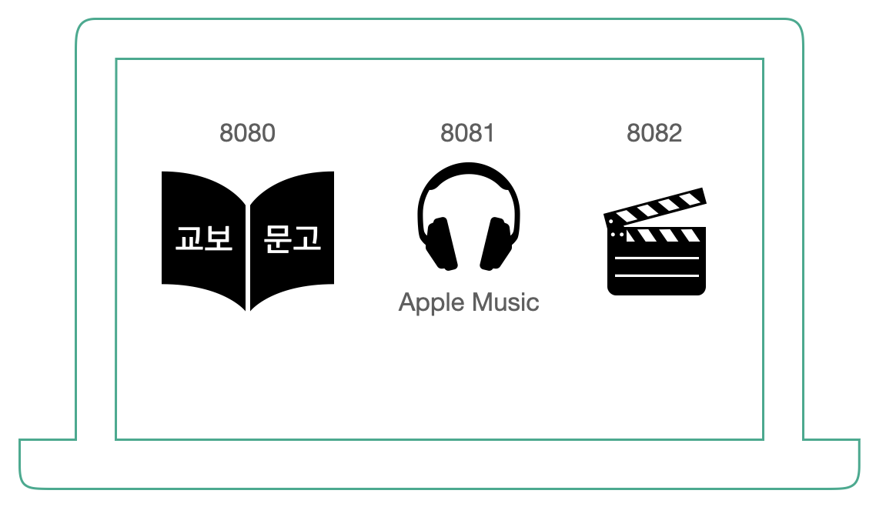
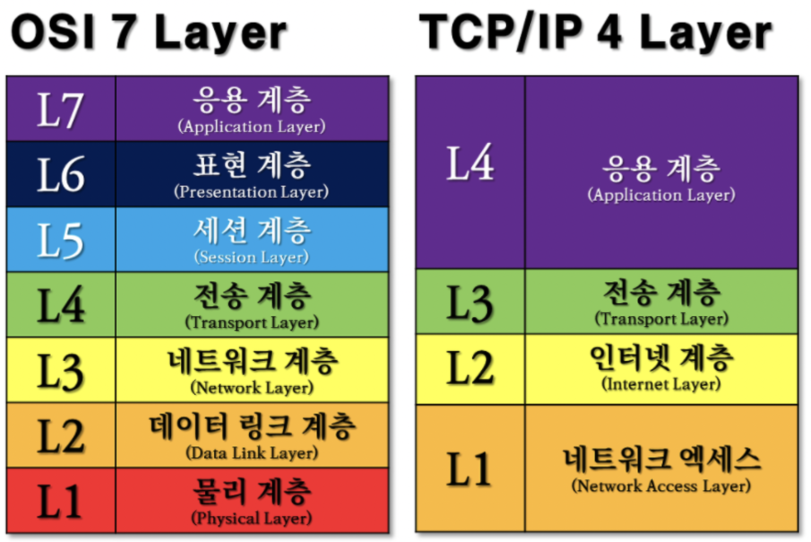

# 네트워크 계층
인터넷을 통해 데이터를 보낼 때 통신이 일어나는 과정을 7가지로 나눈 OSI 계층과 
4가지로 나눈 TCP/IP 4계층에 대해서 알아보겠습니다.  

여기서 생각해보아야 할 점이 왜 계층을 7가지 4가지씩이나 나누는지입니다. 
계층을 나누는 이유는 통신이 일어나는 과정을 단계적으로 파악할 수 있고, 문제가 생기면 찾아내기 쉽기 때문입니다.

## OSI 7계층
1. 물리 계층 
&nbsp;&nbsp;&nbsp;컴퓨터는 0과 1만 이해할 수 있습니다. 따라서 요청이 들어오면 컴퓨터갸 이해할 수 있도록 전기적 신호로 바꿔야 하는데 이 역할을 물리 계층에서 하고 있습니다. 
  

2. 데이터 링크  
&nbsp;&nbsp;&nbsp;컴퓨터가 두 대만 있으면 전기적 신호만 보내면 되지만 여러 컴퓨터가 있는 경우 한 컴퓨터에 여러개의 물리 장치를 연결해야 합니다. 이렇게 되면 선이 복잡해지니 이를 위해 
공유기를 사용하여 여러 컴퓨터를 하나도 묶어줍니다. 그러면 데이터 요청이 공유기로 들어오면 4개의 컴퓨터는 모두 이 데이터를 받을 수 있게 됩니다. 하지만 원하는 장치에게만 데이터를 전송해야 하기 때문에 컴퓨터에 고유한 이름(MAC주소)을 부여하고 이를 같이 활용합니다. 
즉, **데이터 링크 계층은 여러 컴퓨터가 통신할 수 있도록 고유한 번호를 부여하는 계층입니다.** (MAC 주소 사용).    
  
1번 ~ 4번과 같은 맥 주소를 사용하고 데이터를 전송하거나 요청할 때 이를 같이 활용합니다.  
 

3. 네트워크 계층  
&nbsp;&nbsp;&nbsp; 컴퓨터가 더 많아져서 많은 공유기를 사용하고 있다고 가정해보겠습니다. 그러면 특정 공유기에 정확히 도달할 수 있는 방법이 필요합니다. 
네트워크 계층에서는 공유기에 공인IP를 부여하고 자신과 연결되어 있는 장치들에게는 사설IP를 할당합니다. 그러면 네트워크 계층에 있는 수 많은 공유기들은 IP를 이용하여 목적지에 도달하게 됩니다. 
  

4. 트랜스포트 계층  
&nbsp;&nbsp;&nbsp; 이제 한 컴퓨터 안에서 여러 프로그램이 실행되고 있다고 생각해보겠습니다. 요청이 들어왔을 때 어떤 프로그램에게 요청을 주어야 할까요?
이를 구분하기 위해 포트번호라는 것을 부여합니다. 그래서 요청을 보낼 때 ip주소와 포트번호를 같이 보내게 되면 원하는 컴퓨터 원하는 프로그램에게 전달됩니다.  
  

데이터를 보낼 때 패킷이란 것을 이용하는데 이 때 패킷에 IP주소와 포트 번호를 같이 보내주면 여러 응용 프로그램을 사용하고 있는 컴퓨터에서 정확한 응용 프로그램에게 데이터를 전달할 수 있습니다.  

5. 세션 계층  
&nbsp;&nbsp;&nbsp; 목적지에 데이터가 잘 전달 되었는데 컴퓨터가 꺼져 있어서 데이터를 못받는 경우가 있습니다. 그러면 데이터가 제대로 전송되지 않았다는 메세지를 돌려주어야 합니다.
즉, 세션 계층은 두 응용 프로그램간의 연결을 논리적으로 설정하고 유지하며 종료하는 역할을 담당합니다.   

6. 표현 계층  
&nbsp;&nbsp;&nbsp; 표현 계층은 전달받은 데이터를 응용 프로그램이 해석할 수 있도록 디코딩하거나, 데이터 전송의 효율과 보안을 위해 인코딩 하는 역할을 합니다. 
즉, 표현 계층은 암호화, 복호화, 데이터 압축, 인코딩, 디코딩과 같은 추가적인 처리를 하는 계층입니다.   

7. 응용 계층  
서로 다른 응용 프로그램들간에 정보를 교환하기 위해서는 공통적으로 사용하는 언어가 필요합니다. 이러한 공통적으로 사용하는 언어 역할을 제공하는 것이 애플리케이션 영역 입니다.
예를 들어 웹 통신을 위한 HTTP 프로토콜, 메일을 주고 받기 위한 SMTP등이 있습니다.

## TCP/IP 4계층
OSI 7계층에서 관련있는 계층들의 응집도를 높이기 위해 TCP/IP 4계층이 등장하였습니다. 
  
1. 네트워크 엑세스 : 데이터를 전기적신호로 변환한 뒤, 물리적 주소인 MAC 주소를 사용하여, 알맞은 기기로 데이터를 전달하는 계층입니다.
2. 인터넷 계층 : 통신 노드 간에 IP패킷을 전송하고 라우팅하는 기능을 담당합니다.
3. 전송 계층 : 통신 노드 간의 연결을 제어하고, 신뢰성 있는 데이터 전송을 담당합니다. (포트 번호를 사용해, 데이터를 목적지 기기 내 적절한 애플리케이션으로 전달합니다.)
4. 응용 계층 : 사용자와 가장 가까운 계층으로, 사용자-소프트웨어간 소통을 담당하는 계층입니다.

