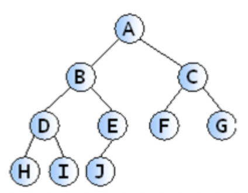

# 자료구조
## Array vs LinkedList
### Array
   배열은 특정 크기만큼 연속된 메모리 공간에 데이터를 저장하는 자료구조이다.  

   
위의 그림처럼 데이터가 연속된 메모리 공간에 나열되어 있기 때문에 처음 주소만 알면 다른 위치도 쉽게 알 수 있다. 
따라서 찾고자 하는 원소의 인덱스 값을 알고 있으면 O(1)에 해당 원소로 접근할 수 있다. 

하지만 삭제 또는 삽입의 과정에서 해당 원소에 접근하여 작업을 완료한 뒤에는, 배열의 빈 공간이 생기기 때문에 삭제한 원소보다 큰 인덱스를 갖는 원소들을 움직이는 비용이 발생하고 이 경우 O(N)이된다. 

### LinkedList
linked list에서 각각의 원소들은 자기 자신 다음에 어떤 원소인지만을 기억하고 있다. 따라서 이 부분만 다른 값으로 바꿔주면 삭제와 삽입을 O(1)만에 해결할 수 있다.

하지만 연결 리스트에 저장되어 있는 특정 데이터를 찾는다면 처음부터 순차적으로 탐색해야 한다.(노드는 연속된 메모리 공간에 존재하지 않고 모두가 떨어져 있기 때문이다)

### plus
Array는 컴파일 과정에서 메모리가 할당되는 정적 메모리 할당인 반면 linked list는 런타임 환경에서 메모리가 할당되는 동적 메모리 할당이다.
또한 배열은 Stack 영영에 메모리 할당이 되고, Linked list는 Heap영역에 할당이 된다

## Stack and Queue
### Stack 
LIFO(Last In First Out) 방식의 자료구조로 한 방향으로 데이터를 집어넣고 꺼낼 수 있는 구조이다.

### Queue
FIFO(First In First Out) 방식의 자료구조로, 터널과 같다. 먼저 들어간 데이터가 먼저 나오는 구조이다. 

## Tree
그래프의 일종으로, 한 노드에서 시작해서 다른 정점들을 순회하여 자기 자신에게 돌아오는 순환이 없는 연결 그래프

### 이진 트리
각 노드가 최대 두 개의 자식을 갖는 트리  

 - 포화 이진 트리 : 모든 리프 노드의 높이가 같고 리프 노드가 아닌 노드는 모두 2개의 자식을 갖는다.  

 - 완전 이진 트리 : 노드를 삽입할 때 왼쪽부터 차례대로 추가하는 이진 트리  

### 힙(Heap)
데이터에서 최댓값과 최솟값을 빠르게 찾기 위해 고안된 완전 이진 트리를 말한다. 
- 최대 힙 : 자식 노드보다 부모 노드의 값이 크다.  

- 최소 힙 : 자식 노드보다 부모 노드의 값이 작다.  

## 해시 테이블
해시 테이블은 key, value로 데이터를 저장하는 자료구조로 빠른 데이터 검색에 유용하다.  
  
해시 테이블은 key값을 해시함수를 적용해 고유한 INDEX를 이용하기 때문에 빠른 데이터 검색이 가능하다.
하지만 해시함수를 통해 나온 인덱스에 충돌이 발생하는 경우 연결된 데이터들을 순차적으로 조회하기 때문에 O(N)이 될 수 있다.

해시함수의 충돌을 해결하는 방법은 두 가지가 있다.
1. 체이닝  
  -> 충돌이 일어나면 버킷 내에서 연결리스트로 데이터들을 연결하는 방식이다.
  -> 해시 테이블이 채워질수록 성능 저하가 선형적으로 발생한다.
2. 개방 주소법  
  -> 다른 버킷에 데이터를 삽입하는 방식
  -> 삽입 삭제시 오버헤드가 적다.

