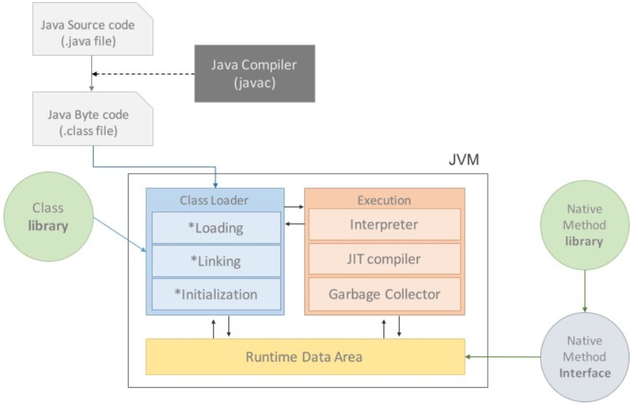

OS마다 같은 이진수를 입력해도 서로 이해하는 것이 다르다. 따라서 OS마다 기계어 코드로 변환할 때 CPU와 운영체제에 종속적인 코드로 변환을 해야 한다. 그런데 Java는 OS에 종속적이지 않다. 이것이 어떻게 가능한 것일까?

### JVM이란?

Java Virtual Machine으로 자바를 실행할 수 있도록 도와주는 가상 기계로  OS에 종속되지 않고 실행할 수 있도록 도와준다. 보통 프로그램을 실행하면 CPU와 운영체제에 맞춰 기계어로 컴파일하는 과정을 거친다(아래 왼쪽). 하지만 자바는 JVM이라는 가상 머신에서 JVM이 인식할 수 있는 바이트코드(.class파일)로 변환된다. 그러면 JVM이 바이트코드를 OS가 이해할 수 있도록 해석해준다. 

#### 자바 컴파일러

자바의 컴파일러는 .java 파일을 .class의 바이트코드로 변환한다. 여기서 자바 컴파일러는 JDK를 설치하면 bin에 존재하는 javac.exe를 지칭한다. 

#### 바이너리 코드 vs 기계어

1\. 바이트 코드 : JVM이 이해할 수 있는 언어로 변환된 자바 소스코드로 컴퓨터가 인식할 수 있는 0과 1로 구성되어 있다.

2\. 기계어 : 0과 1로 이루어진 바이너리 코드이다. 모든 이진코드가 기계어는 아니고, CPU가 이해하는 명령어 집합을 의미하며, CPU제조사마다 기계어가 다를 수 있다.

### JVM의 구조

#### 클래스 로더

자바는 런타임에 클래스를 로드하고 링크하는 특징이 있는데 이런 동적 로딩이 가능하게 해주는 것이 클래스 로더이다. 즉, 메모리에 클래스 파일을 로드하고, 링크를 통해 파일을 배치하는 작업을 수행한다. 이를 위해 총 3 단계를 거친다.

1.  로딩 : 바이트 코드를 메서드 영역에 저장한다. 이 때 로드된 클래스와 부모 클래스의 정보, 클래스 파일과, class, Interface 여부, 변수, 메소드 등이 포함된다.
2.  링크 : 읽어 들인 클래스가 자바 언어 또는 JVM의 규칙에 맞는지 검사한다. -> 클래스가 필요로 하는 메모리를 할당하고, 클래스에 정의된 필드, 메소드, 인터페이스를 나타내는 데이터 구조를 준비한다 -> 심볼릭 메모리 레퍼런스를 메소드 영역에 있는 실제 레퍼런스로 교체한다. 
3.  초기화 : 클래스 변수들을 적절한 값으로 초기화 한다. 즉, static 변수의 값이 할당된다.

> 자바의 클래스 로딩은 클래스 참조 시점에 JVM에 코드가 링크되고, 실제 런타임 시점에 로딩된다. 

#### 실행 엔진

클래스를 실행시키는 역할을 한다. 바이트 코드는 CPU가 이해할 수 없는 형태로 기술되어 있기 때문에 실행 엔진에서 바이트 코드를 기계가 실행할 수 있는 형태로 변경한다.

1.  인터프리터 : 바이트 코드를 한 줄씩 읽으면서 실행한다.
2.  JIT (Just-In-Time) :  인터프리터 방식으로 실행하면 한 줄씩 읽으면서 실행하기 때문에 이러한 단점을 보완하기 위해 등장했다. 실행하다가 적절한 시점에 바이트 코드 전체를 컴파일하여 기계어로 변경하고, 이후에는 더 이상 인터프리팅 하지 않고 기계어로 직접 실행하도록 도와준다.
3.  가비지 컬렉터 : 더 이상 사용되지 않는 인스턴스를 찾아 메모리에서 제거한다.

#### 메모리

자바 애플리케이션을 실행하면 사용되는 데이터들은 이 메모리에 적재된다.

1.  스택 영역 : 지역 변수, 파라미터, 리턴 값과 같은 임시 값들이 생성되는 영역이다. 
2.  PC Register : 쓰레드가 생성될 때마다 생성되는 영역으로 현재 쓰레드가 실행되는 부분의 주소와 명령을 저장하고 있는 영역이다.
3.  네이티브 메소드 스택 : 자바 외 언어로 작성된 네이티브 코드를 저장하는 공간이다.
4.  힙 : new 키워드로 생성된 객체와 배열이 생성되는 영역이다. 
5.  메소드 영역 : 모든 스레드가 공유하는 영역으로 JVM이 시작될 때 생성된다. 클래스와 인터페이스, 필드, 메서드, static 변수, 바이트 코드등에 대한 정보를 가지고 있다.

> 클래스 수준의 정보는 스택에 저장되고 객체의 인스턴스는 힙영역에 생성된다. 이때, 스택영역에 힙영역의 주소값도 저장된다.