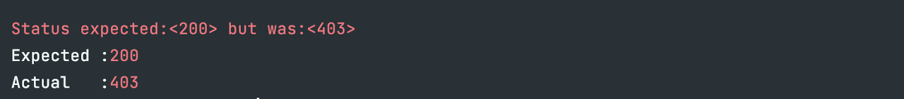
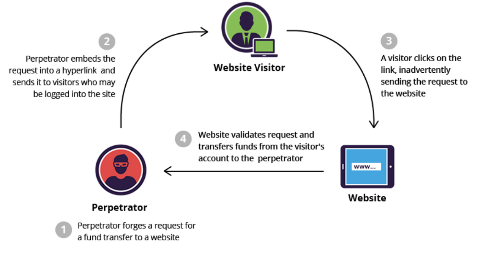
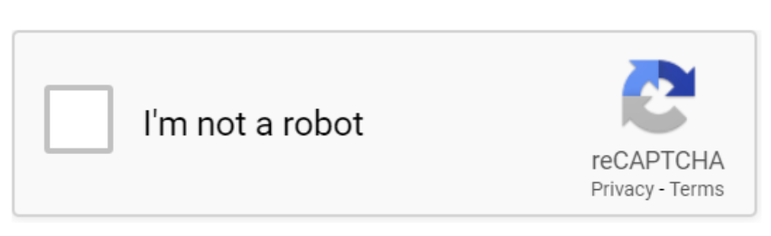
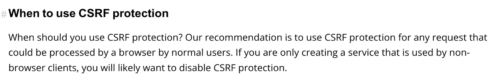
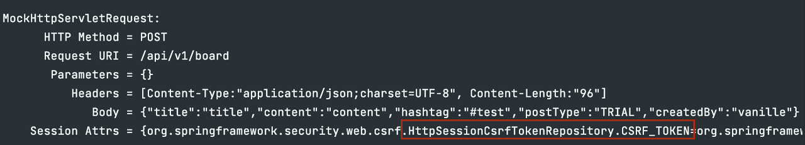
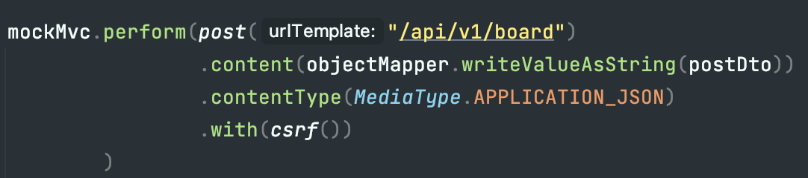
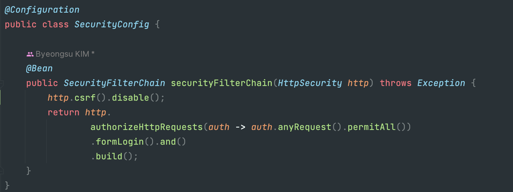
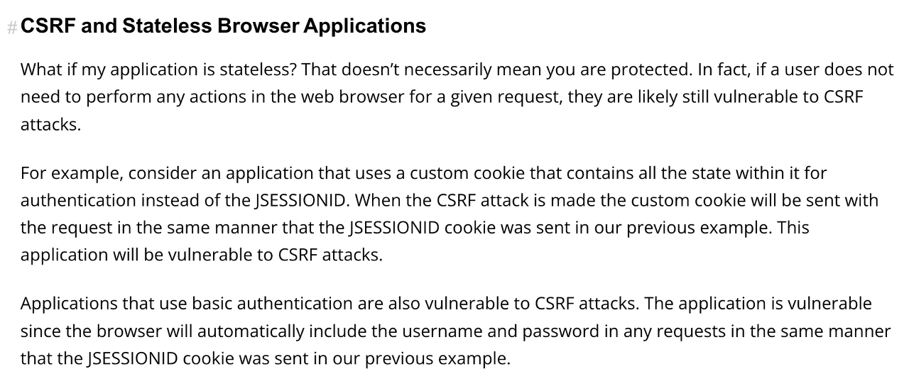

# 스프링 시큐리티와 CSRF문제
### 문제
스프링 시큐리티 의존성을 추가하자 403 Forbidden 에러가 발생하였습니다. 
403에러는 클라이언트가 본인에게 허용되지 않은 리소스를 요청했을 때 발생하는데 왜 이전에는 문제 없던 403에러가 발생했을까요?  

### CSRF
이 문제를 이해하기 위해 먼저 CSRF(Cross-Site Request Forgery)에 대해서 이해해야 합니다. 사이트 간 요청 위조로 불리는 CSRF는 사용자가 자신의 의지와는 무관하게 공격자가 의도한 행위(수정, 삭제 등록 등)를 웹 사이트에게 요청하게 하는 공격을 의미합니다.
그렇다면 이러한 공격은 어떻게 이루어질까요?  

  
출처 : https://www.imperva.com/learn/application-security/csrf-cross-site-request-forgery/

로그인된 사용자(인증된 사용자)가 친구에게 계좌이체를 한다고 가정해봅시다. 
사용자는 이체를 하기 위해 요청을 보내야하는데요, 이를 위해 버튼 등을 누르는 것이 일반적입니다. 
해커는 이런 취약점을 이용해 버튼에 자신의 계좌로 이체가 되도록 링크를 숨겨 놓을 수 있습니다.

#### CSRF문제를 방지하는 방법
그렇다면 CSRF는 어떻게 막을 수 있을까요?

1. CAPCHA를 사용할 수 있습니다.  
     

2. Referrer 검증  

   요청이 들어올 때 요청 헤더에 담겨있는 referrer 값을 확인하여 같은 도메인에서 보낸 요청인지 확인하는 방법이 있습니다.

3. CSRF Token 사용

   사용자의 세션에 임의의 값을 저장하여 모든 요청마다 이 값을 같이 전송합니다. 서버에서는 이 값을 세션에 저장된 값과 일치하는지 검증하여 CSRF를 막습니다.

스프링 시큐리티와 CSRF
스프링 시큐리티는 기본적으로 CSRF(Cross-Site Request Forgery) 공격을 방지하는 기능을 제공하고 있으며, 모든 요청에 대해서 CSRF를 사용할 것을 권장하고 있습니다.
  

실제로 스프링 시큐리티를 실행하면 다음과 같이 모든 요청에 CSRF토큰을 전송하는 것을 확인할 수 있습니다.
  

MockMvc테스트에서는 다음과 같이 with(csrf())를 추가하면 이를 해결할 수 있습니다.
  

그런데 많은 블로그에서는 이 CSRF문제에 대해서 다음과 같은 해결책을 제시하고 있습니다. 즉, http.csrf().disable()를 추가하는 것인데요 이래도 괜찮을 걸까요?  
  

스프링 공식문서에서는 다음과 같이 말하고 있습니다. 만약 상태를 보관하지 않고 모든 요청을 독립적으로 보는 stateless 어플리케이션의 경우 CSRF 방지는 필수가 아니라고 합니다.  
  

