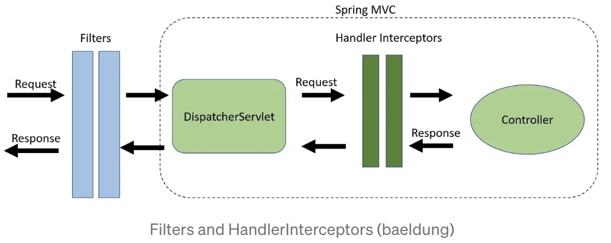

# 필터와 인터셉터

## 필터 (Filter)
### 필터란?
   필터는 디스패처 서블릿에 요청이 전달되기 전/후에 URL 패턴에 맞는 요청에 대해 부가작업을 처리할 수 있는 기능을 제공합니다.
 

### 필터가 제공하는 메소드 
1. init() : 필터 객체의 초기화 역할.
2. doFilter() : 필터링 작업 역할.
3. destroy() : 필터 객체 자원 반환 및 서비스 제거 

## 인터셉터 (Interceptor)
### 인터셉터란?
필터와 비슷하지만, 서블릿이 아닌 스프링에서 제공하는 기술로 디스패처 서블릿이 컨트롤러를 호출하기 전과 후에 요청과 응답을 참조하거나 가공할 수 있는 기능을 제공합니다.

### 인터셉터가 제공하는 메소드
1. preHandle() : 컨트롤러에 요청을 전송하기 전에 수행된다. 
2. postHandle() : 사용자에게 응답을 보내기 전에 수행된다.
3. afterCompletion() : 요청과 응답을 보낸 후에 수행된다.

## 필터 vs 인터셉터 
### Request/Response 객체 조작 여부   
 -> 필터는 Request와 Response를 조작할 수 있지만 인터셉터는 조작할 수 없다.   
 -> 필터는 doFilter() 메소드를 정의하지 않으면 다음 필터가 실행되지 않는다. 

 ~~~java
 public PracFilter implements Filter {
public void doFilter(ServletRequest request, ServletResponse response, FilterChain chain) {
        
        // request, response에 커스텀한 정보를 넣을 수 있음. 
        chain.doFilter(request, response);       
    }
 }
 ~~~
 -> 인터셉터는 디스패처 서블릿이 인터셉터 목록을 가지고 있고 for문으로 순차적으로 실행시키며 true를 반환하면 다음 인터셉터가 실행되고, false가 반환되면 중단되는 구조를 가지고 있다. 
 ~~~java
public class PracInterceptor implements HandlerInterceptor {

    default boolean preHandle(HttpServletRequest request, HttpServletResponse response, Object handler) {
        
        // true or false
        return true;
    }

}
 ~~~

### 필터 용도
필터는 스프링과 서블릿 기반으로 동작하기 때문에 스프링과 무관한 작업을 처리하기 용이하며 ServletRequest/ServletResponse 객체를 조작할 수 있다.
1. 공통된 보안 및 인증/인가 작업
2. 모든 요청에 대한 로깅
3. 문자열 인코딩 및 이미지 압축
4. 스프링과 분리되어야 하는 기능

### 인터셉터 용도
클라이언트의 요청과 관련하여 전역적으로 처리해야 하는 작업들을 처리할 때 용이하다. 
1. 세부적인 보안 및 인증/인가 공통 작업
2. API 호출에 대한 로깅
3. Controller로 넘겨주는 정보의 가공

## 참고
[필터 vs 인터셉터](https://mangkyu.tistory.com/173)