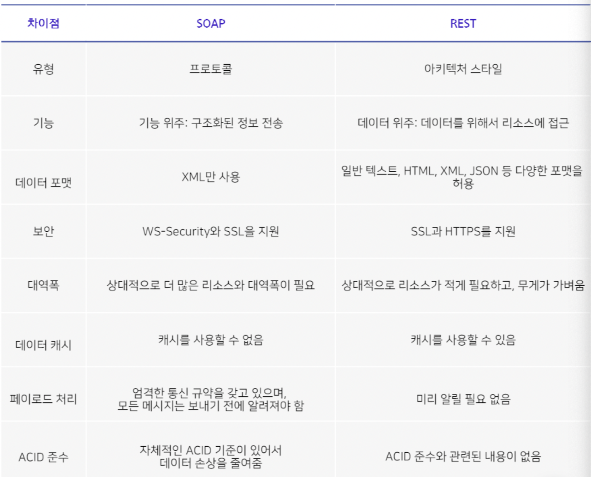

# 개발 기본 상식
## SOAP VS REST 
   API의 구조에는 대표적으로 SOAP과 REST가 있다. SOAP은 프로토콜이고, REST는 아키텍처 스타일이다. 

### SOAP
SOAP(Simple Object Access Protocol)는 XML 데이터 포맷을 기반으로 통신이 이루어지는 프로토콜입니다.
보인이나 메세지 전송 등에 있어서 REST보다 더 많은 표준들이 정해져 있어 REST에 비해 복잡하고 사이즈가 크다.  
이러한 표준들로 인해 오버헤드가 많기는 하지만, 보안, 트랜잭션, ACID(원자성, 일관성, 고립성, 지속성)을 준수해야 하는 보다 종합적인 기능이 필요한 조직에게는 적합할 수 있다. 
즉, 보안 수준이 엄격하기 때문에 은행용 모바일 앱처럼 수준이 높아야 하거나, 신뢰할 수 있는 메시징 앱 또는 ACID를 준수해야 하는 경우라면 SOAP 방식이 적합하다.
REST에서는 통신 장애가 있으면 재시도를 해야 하지만, SOAP 표준에는 성공/반복 실행 로직이 규정되어 있기 때문에, SOAP API를 통해서 통신을 할 때 처음부터 끝까지 신뢰성을 제공한다.

#### 장점
1. 프로그래밍 언어를 지원하며, HTTP 프로토콜만 사용하는 것이 아니라 모든 통신 프로토콜을 통합할 수 있다.
2. WS 보안 프로토콜과 같은 내장 보안 프로토콜을 제공한다.
3. SOAP API는 오류 처리를 위한 기본 제공 옵션을 제공한다.

#### 단점
1. 기본적으로 요구하는 표준이 많기 때문에 복잡하다.
2. REST에 비해 상대적으로 무거우며 속도도 느리다.

### REST
REST(Representational State Transfer)는 HTTP URI를 통해 자원을 명시하고,
HTTP METHOD를 통해 해당 자원에 해당 행위를 묘사하는 것을 의미한다. 
즉, REST는 자원을 기준으로 HTTP METHOD를 통해 정보를 얻도록 설계된 아키텍쳐를 의미한다.

#### 특징
1. Uniform (유니폼 인터페이스) : HTTP 표준만 따르면, 특정 언어나 기술에 종속되지 않고 모든 플랫폼에서 사용할 수 있다. 
2. Stateless (무상태성) : 상태정보를 따로 저장하고 관리하지 않는다. 따라서 서비스의 자유도가 높아지고 구현이 단순해진다.
3. Cacheable (캐시가능) : HTTP 기존 웹 표준을 그대로 사용하기 때문에, 웹에서 사용하는 기존 인프라를 그대로 활용할 수 있다. 
4. Self-descriptiveness (자체 표현 구조) : REST의 또 다른 큰 특징 중 하나는 REST API 메세지만 보고도 이를 쉽게 이해할 수 있다.
5. Clinet-Server 구조 : 클라이언트와 서버가 명확히 구분되어 서로 간 의존성이 줄어들게 된다.
6. 계층형 구조 : REST 서버는 다중 계층으로 구성될 수 있으며, 보안, 로드 밸런싱, 암호화 계층을 추가해 구조상의 유연성을 둘 수 있다.

#### 장점
1. HTTP 표준 프토로콜에 따르는 모든 플랫폼에서 사용이 가능하다.
2. REST API 메세지가 의도하는 바를 쉽게 알 수 있따. 
3. 서버와 클라이언트의 역할을 명확하게 분리한다. 

#### 단점
1. 표준 존재하지 않아 정의가 필요하다
2. 사용할 수 있는 메소드가 4가지밖에 없다.

### SOAP VS REST

[참고](https://blog.wishket.com/soap-api-vs-rest-api-두-방식의-가장-큰-차이점은/)