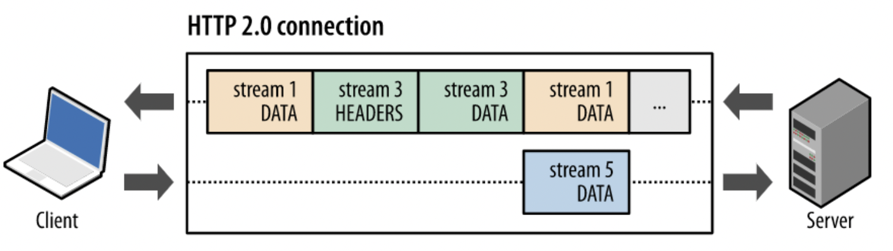

# HTTP란?
### HTTP란?
하이퍼텍스트 전송 프로토콜 (HyperText transfer Protocol)로 웹 서버와 사용자의 인터넷 브라우저 사이에 문서를 전송하기 위해 사용되는 통신 규약을 의미한다. 

하이퍼 텍스트는 문서 중간중간에 특정 키워드를 두고 문자나 그림을 상호 유기적으로 결합하여 연결시킴으로써, 
서로 다른 문서라 할지라도 하나의 문서인 것 처럼 보이면서 참조하기 쉽도록 하는 방식을 의미한다. 

### HTTP의 변천사
1. HTTP 1.0  
 -> HTTP 1.0은 기본적으로 Connection 당 하나의 요청만 처리할 수 있기 때문에 멀티미디어 리소스들이 있는 상황에서는 네트워크 지연을 발생시킨다.

2. HTTP 1.1  
 -> 파이프라이닝 기법을 이용하여 하나의 연결에 여러 개의 파일을 요청/응답할 수 있도록 한다. 이 방법은 먼저 온 데이터를 처리할 때 까지 나머지 데이터들은 대기해야 하는 문제가 생긴다.
이를 Head of Line Blocking이라 부른다.
~~~xml
|----dataA-----|
               |----dataB-----|
                              |----dataC----|
~~~

3. HTTP 2.0  
 -> Head of Line Blocking 문제를 해결하기 위해 여러 파일을 스트림 형태로 전송하는 방식을 취한다. -> 병렬 전송이 가능해짐.  
  
 -> HTTP 1.1에서는 메세지가 text로 전송되지만, 2.0에서는 binary frame으로 전송된다. (데이터 파싱 및 전송 속도 증가)
 -> 이전 Header의 내용과 중복되는 필드를 재전송 하지 않도록 하여, 데이터를 절약하며, HPACK이라는 압축 방식을 이용하여 데이터 전송 효율이 높다.

### HTTP의 특징 
1. 클라이언트 서버 구조  
 -> 클라이언트가 서버에 요청을 보내면 서버는 그에 대한 응답을 보내는 구조    
2. 무상태 프로토콜  
 -> 서버가 클라이언트의 상태를 보존하지 않는 무상태 프로토콜  
 -> 서버 확장성 높지만, 클라이언트가 추가 데이터를 전송해야 한다는 단점이 있음.   
3. 비 연결성 
 -> HTTP 1.0 기준으로 HTTP는 연결을 유지하지 않는 모델이다.  
 -> TCP/IP 연결을 새로 맺기 때문에 3-way-handshake 시간과 css, js와 같은 자원이 함께 다운로드 해야 하는 단점이 있다.
 -> 이러한 단점을 해결하기 위해 HTTP 지속 연결로 문제를 해결한다. 

#### HTTP 지속 연결
HTTP 지속 연결에서는 연결이 이루어지고 난 뒤 각각의 자원들을 요청하고 모든 자원에 대한 응답이 돌아온 후에 연결을 종료한다. 

[참고](https://hanamon.kr/%EB%84%A4%ED%8A%B8%EC%9B%8C%ED%81%AC-http-http%EB%9E%80-%ED%8A%B9%EC%A7%95-%EB%AC%B4%EC%83%81%ED%83%9C-%EB%B9%84%EC%97%B0%EA%B2%B0%EC%84%B1/)

