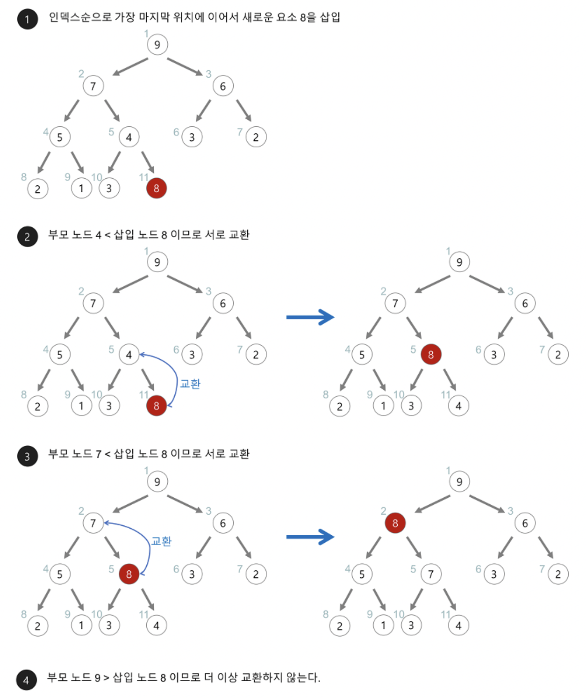
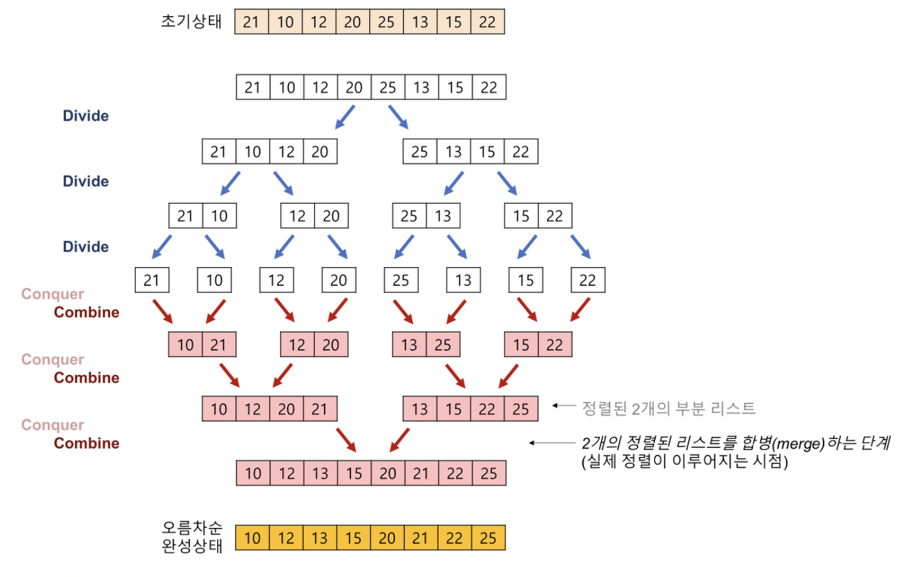
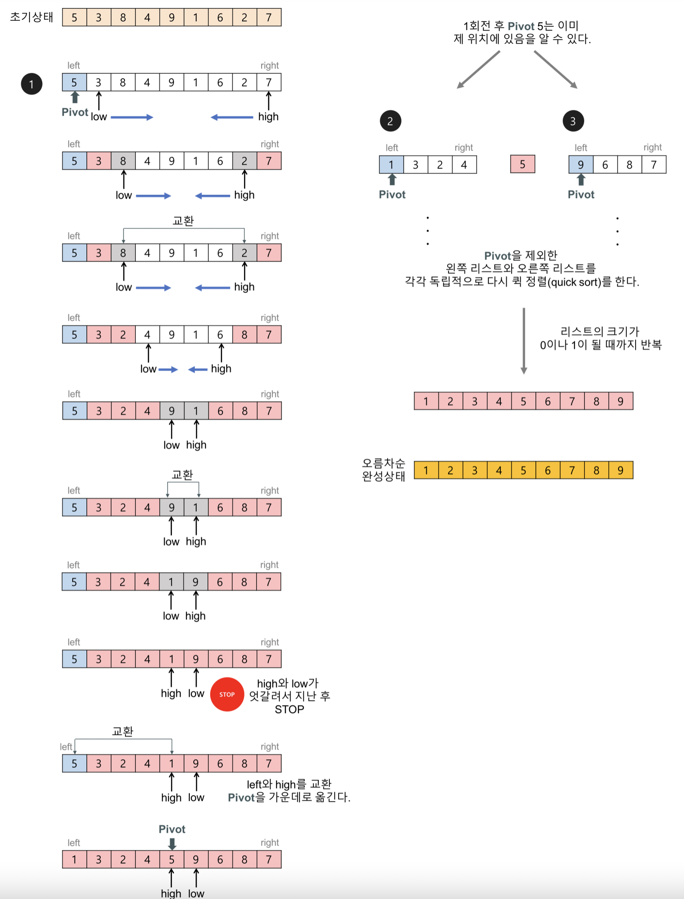

# 알고리즘
## Sort
### 힙 소트 
   주어진 데이터를 힙 자료구조로 만들어 최대값 또는 최소값부터 하나씩 꺼내서 정렬하는 알고리즘으로 가장 큰 값 몇 개만을 필요로 하는 경우 유용하다. O(nlogn)
   
   
### 머지 소트
주어진 배열을 크키가 1인 배열로 분할하고 합병하면서 정렬을 진행하는 분할/정복 알고리즘이다. O(nlogn)

~~~java
public static void mergeSort(int[] list, int left, int right) {
  if(left < right) {
      int mid = (left + right) / 2;
      mergeSort(list, left, mid);
      mergeSort(list,mid + 1, right);
      merge(list, left, mid, right);
  }
}

public static void merge(int[] list, int left, int mid, int right) {
     int i = left, j = mid + 1, k = left, l;

     while(i <= mid && j <= right) {
        if (list[i] <= list[j]) {
            sorted[k++] = list[i++];
        } else {
            sorted[k++] = list[j++];
        }
    }

     // 남아 있는 값 일괄 복사
     if(i > mid) {
         for(l = j; l <= right; l++){
             sorted[k++] = list[l];
         }
     } else {
         for(l = i; l <= mid; l++) {
             sorted[k++] = list[l];
         }
     }

     for(l = left; l <= right; l++) {
         list[l] = sorted[l];
     }
}
~~~

### 퀵 소트
피봇을 설정하여 리스트를 비균등하게 분할하는 분할 정복 알고리즘이다. O(nlogn)이 보통이지만 리스트가 계속해서 불균등하게 나눠지는 경우 O(N^2)이 되기도 한다.

~~~java
public static void quickSort(int[] data, int start, int end) {
        if(start >= end) {
            return;
        }

        int pivot = start;
        int i = pivot + 1;
        int j = end;
        int temp;
        while(i <= j) {
            while(i <= end && data[i] <= data[pivot]) {
                i++;
            }
            while(j > start && data[j] > data[pivot]) {
                j--;
            }

            if(i > j) {
                temp = data[j];
                data[j] = data[pivot];
                data[pivot] = temp;
            } else {
                temp = data[i];
                data[i] = data[j];
                data[j] = temp;
            }
        }

        quickSort(data, start, j - 1);
        quickSort(data, j + 1, end);
    }
~~~