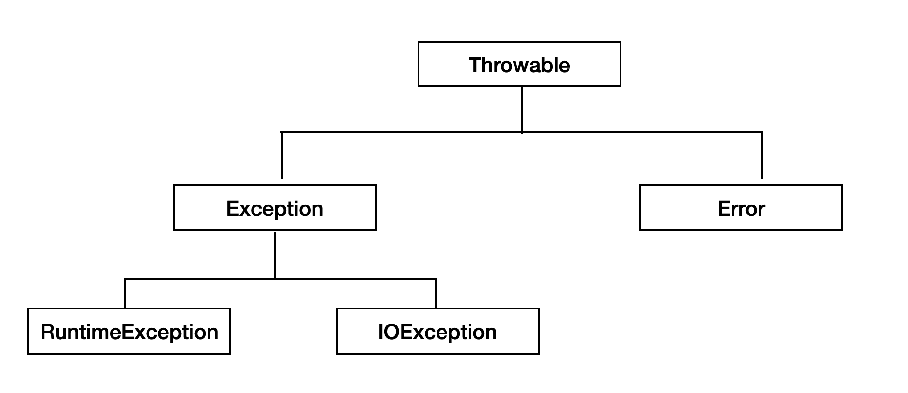

# 복구할 수 있는 상황에는 검사 예외를, 프로그래밍 오류에는 런타임 예외를 사용하라 
자바는 문제 상황을 알리는 타입으로 세 가지를 제공한다.

## 자바 예외 클래스의 계층구조
이 챕터를 공부하기 전에 자바 예외 클래스의 계층 구조를 보고 간단하게 살펴보자
  

예외는 복구 유무에 따라 크게 두 가지로 구분할 수 있다. 
### Error 클래스
Error 클래스는 메모리 부족이나 스택오버플로우와 같이 일단 발생하면 복구할 수 없는 심각한 오류이다. 에러가 발생하면 프로그래머가 할 수 있는 일은 없다. 

### Exception 클래스
예외는 발생하더라도 프로그래머가 이에 대한 적절한 조취를 미리 취해놓을 수 있다. 에러 발생지에 따라 두 가지로 구분될 수 있다.
1. RuntimeException : 프로그래머들의 실수에 의해 발생할 수 있는 예외가 주로 발생한다.
   - 컴파일러가 인지 못하고, 실행 중에 발생한 문제로 '**비검사 예외**'라고 한다.
   - `ArrayIndexOutOfBoundException`, `NullPointerException`
2. 그 외 클래스 : 외부의 영향으로 발생할 수 있는 것들로, 프로그램 사용자들의 동작에 의해 발생한다.
   - 컴파일 단계에서 컴파일러가 에러를 체크하며 이를 '**검사 예외**'라고 한다.
   - `FileNotFoundException`

## 문제 상황에 맞는 예외 타입을 사용하자
호출하는 쪽에서 복구하기를 원한다면 검사 예외를, 그 외는 비검사 예외를 이용하자.

### 검사 예외를 사용하는 경우
호출하는 쪽에서 복구하리라 여겨지는 상황에는 검사 예외를 사용하자. 검사 예외를 던지면 호출자가 그 예외를 catch로 잡아 처리하거나 더 바깥으로 전파하도록 강제할 수 있다.
복구할 수 있는 조건일 때 발생하기 때문에, API 설계자는 호출자가 예외 상황에서 벗어나는 데 필요한 정보를 알려주는 메서드를 함께 제공하는 것이 좋다.

### RuntimeException과 Error
RuntimeException과 Error는 비검사 예외로, 복구할 수 없는 예외가 발생하는 경우가 대부분임으로 프로그램에서 이 예외를 잡을 필요가 없다.

#### RuntimeException
 - 런타임 예외의 대부분은 전제조건을 만족하지 못했을 때 발생한다. 예를 들어 클라이언트가 해당 API 명세에 기록된 제약을 지키지 못했을 경우이다.

#### Error
 - 에러는 보통 JVM이 자원 부족, 불변식 깨짐 등 더 이상 수행할 수 없는 상황을 나타날 때 사용한다. 우리가 구현하는 비검사 예외는 모두 RuntimeException이여야 한다.
