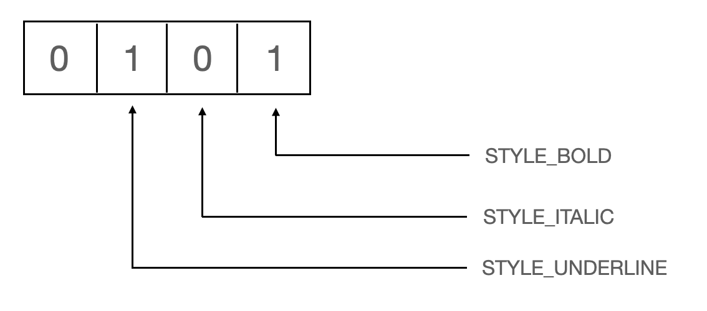

# 비트 필드 대신 EnumSet을 사용하라
## 비트 필드 
   비트 필드는 비트 연산을 통해 합집합과 교집합 같은 연산을 효율적으로 할 수 있도록 도와준다. 예를 들어 다음 코드를 보자.

~~~java
public class Text {
    public static final int STYLE_BOLD = 0;
    public static final int STYLE_ITALIC = 1;
    public static final int STYLE_UNDERLINE = 4;
    public static final int STYLE_STRIKETHROUGH = 8;
    
    ...
}
~~~

각각을 비트 필드로 표현해보면 다음과 같다.  

비트 필드의 문제는 다음과 같다.
1. 비트 필드의 값이 그대로 출력되면 단순한 정수 열거 상수를 출력할 때보다 해석하기가 어렵다. 

~~~TEXT
비트 필드 : { 0101 },  { STYLE_BOLD, STYLE_UNDERLINE }
~~~

2. 최대 몇 비트가 필요한지를 API 작성 시 미리 예측하여 적절한 타입(long 또는 int)를 선택해야 한다.

## EnumSet 클래스
   EnumSet은 Set을 완벽히 구현하며, 타입 안전하다. 단지 내부가 비트 벡터로 구현되었다. EnumSet은 빌드 필드에 비견되는 성능을 제공하면서도 비트를 직접 다룰 때 겪는 오류들을 해결해준다.
   
~~~java
public class Text {
    public enum Style { BOLD, ITALIC, UNDERLINE, STRIKETHROUGH }
    
    public void applyStyles(Set<Style> styles) { ... }
}

public class Clinet {
    public static void main(String[] args) {
        Text text = new Text();
        text.applyStyles(EnumSet.of(Style.BOLD, Style.ITALIC));
    }
}
~~~

### 비트 필드 참고 사이트
http://underpop.online.fr/j/java/hardcore-java/hardcorejv-chp-7-sect-2.html
