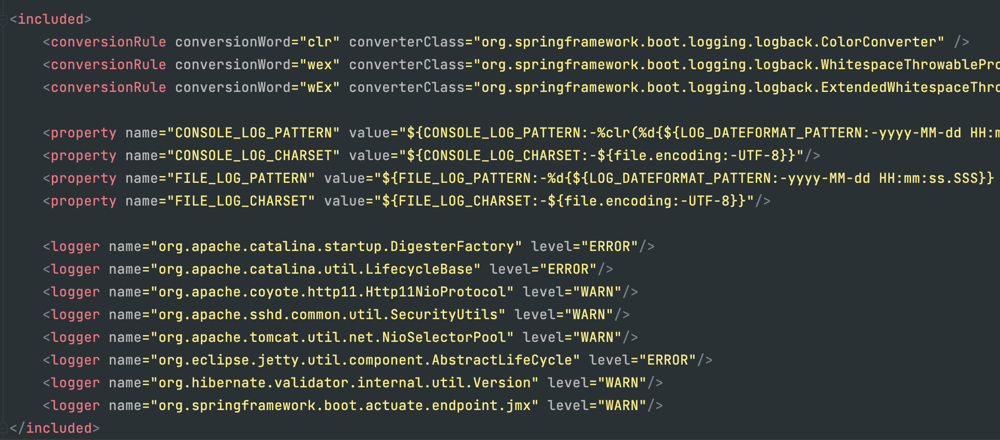

# Logback 
## 도입
콘솔 로그를 확인하기 위해 System.out.println()을 사용할 수 있는데요, 왜 실무에서는 logging을 사용할까요?

이유는 다음과 같습니다
1. 콘솔 로그 출력을 커스텀할 수 있다.  
-> 스레드, 클래스 이름을 같이 출력 시킬 수 있고, 칸 수를 조절할 수 있다.
2. 개발 서버에서는 콘솔 로그를 확인할 수 없다. 따라서 파일 등으로 관리해야 한다. 
3. print()문을 썻을 때보다 내부 버퍼링, 멀티 스레드 등의 환경에서 훨씬 좋다.  
~~~java
public void println() {
    newLine();
}

private void newLine() {
    try{
        synchronized (this){
            ...
        }
    }
}
~~~

## 로그 
### 로그레벨 
1. FATAL : 심각한 에러가 발생했을 때 알려주기 위한 용도
2. ERROR : 일반 에러가 발생했을 때 알려주기 위한 용도
3. WARN : 주의를 줄 때 사용
4. INFO : 일반 정보를 제공하기 위한 용도
5. DEBUG : 일반 정보를 상세히 나타내기 위한 용도

### Appender
   로그를 출력 할 위치, 출력 형식 등을 설정하도록 도와주며, 자주 사용되는 appender는 다음과 같다.
1. console-appender : 로그의 내용은 콘솔에 기록한다.
2. file-appender : 로그의 내용을 파일에 기록한다.
3. rolling-appender : 날짜, 최대 용량 등을 설정하여 지정 파일명 패턴에 따라 로그가 각기 다른 파일로 기록된다.

## 실습
### Local 로거 만들기
1. 먼저 root log설정 파일을 만듭니다.
  [logback-spring.xml]
~~~xml
<?xml version="1.0" encoding="UTF-8" ?>
<configuration>
    <include resource="org/springframework/boot/logging/logback/defaults.xml"/> 
    <include resource="logback-spring-${spring.profiles.active}.xml"/>
</configuration>
~~~

 a ) defaults.xml에는 다음과 같은 로깅과 같은 기본 설정 정보가 적혀 있습니다. 이 정보를 활용하기 위해 defaults.xml을 include합니다.

 b ) 개발 서버에서는 IDE 콘솔에서 로그를 확인하는 것이 편하지만, 운영 서버에서는 콘솔을 확인할 수 없으므로 파일로 로그를 찍어야 합니다. 
이에 따라 로그 설정도 달라져야 합니다. 이를 위해 active된 로그 설정 파일을 불러올 수 있도록 설정해 주겠습니다.

2. local logback을 만들어 보겠습니다.  
~~~xml
<included>
    <include resource="org/springframework/boot/logging/logback/console-appender.xml"/>
    <root level="DEBUG">
        <appender-ref ref="CONSOLE"/>
    </root>
</included>
~~~
 a ) local은 console 로그를 찍을 예정이므로 console-appender를 가져오겠습니다.  
 b ) 출력을 위해서 로그 레벨과 레퍼런스를 설정해주겠습니다.

### 커스텀 Appender 만들기
   이번엔 커스텀 형식으로 로그가 출력되도록 해보겠습니다. 이를 위해 먼저 appender를 정의해 주어야 합니다. 콘솔에 출력할 것이므로 ConsoleAppender로 설정하였습니다.
~~~xml
<!--  custom appender  -->
<appender name="CONSOLE2" class="ch.qos.logback.core.ConsoleAppender">
    <filter class="ch.qos.logback.classic.filter.ThresholdFilter">
        <level>INFO</level>
    </filter>
    <layout>
        <!--            로그가 어떤 형식으로 출력 될 것인지 정할 수 있다.       -->
        <pattern>
            [CONSOLE2] [%-5level] %d{yyyy-MM-dd HH:mm:ss} [%thread] [%logger{0}:%line] - %msg%n
        </pattern>
    </layout>
</appender>
~~~

이후 CONSOLE2 appender를 root에 추가해주면 됩니다.
~~~xml
<root level="DEBUG">
    <appender-ref ref="CONSOLE2"/>
</root>
~~~

### Prod 로거 만들기
  운영 서버에서는 파일로 로그를 관리하기 때문에 file 또는 rolling-appender를 사용할 수 있습니다. 
  rolling-appender는 시간, 파일 크기 등 다양한 옵션으로 파일을 추출할 수 있기 때문에 rolling-appender를 사용하도록 하겠습니다.
~~~xml
<appender name="REQUEST" class="ch.qos.logback.core.rolling.RollingFileAppender">
        <file>logs/request.log</file>
        <rollingPolicy class="ch.qos.logback.core.rolling.SizeAndTimeBasedRollingPolicy">
            <fileNamePattern>
                logs/archive/request.%d{yyyy-MM-dd}_%i.log <!-- 파일 이름 형식 -->
            </fileNamePattern>
            <maxFileSize>1KB</maxFileSize> <!-- 로그파일의 최대 크기 -->
            <maxHistory>30</maxHistory> <!-- 로그파일 최대 보관주기 (단위 : 일) -->
        </rollingPolicy>
        <encoder class="ch.qos.logback.classic.encoder.PatternLayoutEncoder">
            <pattern>
                [REQUEST] [%-5level] %d{yyyy-MM-dd HH:mm:ss} [%thread] [%logger{0}:%line] - %msg%n
            </pattern>
        </encoder>
    </appender>
~~~

### 속성값 파일로 관리하기
다음과 같이 커스텀 appender를 여러개 만들었다고 가정해보겠습니다.
~~~xml
<appender name="REQUEST" class="ch.qos.logback.core.rolling.RollingFileAppender">
    <file>logs/request.log</file>
    ...
</appender>
<appender name="REQUEST2" class="ch.qos.logback.core.rolling.RollingFileAppender">
    <file>logs/request.log</file>
    ...
</appender>
~~~

현재는 logs라는 폴더에 로그 파일을 기록하고 있는데 logs/archive라는 폴더에 기록하고 싶으면 모든 appender의 경로를 하나씩 다 수정해주어야 합니다.
이런 경우를 방지하기 위해 중복되고 반복되는 값을 속성 변수로 관리할 수 있습니다.  
[logback-variables.properties]
~~~xml
LOG_DIR=logs
~~~

~~~xml
    <!-- 프로퍼티 속성 파일을 명시해줍니다. -->
    <property resource="logback-variables.properties"/>

    <appender name="REQUEST" class="ch.qos.logback.core.rolling.RollingFileAppender">
        <file>${LOG_DIR}/request.log</file>
        ...
    </appender>
    <appender name="REQUEST2" class="ch.qos.logback.core.rolling.RollingFileAppender">
        <file>${LOG_DIR}/request.log</file>
        ...
    </appender>
~~~

